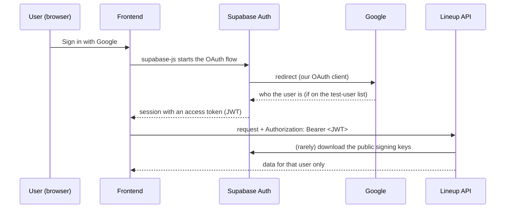

# Auth Setup

How sign-in works and the one-off clicks needed to switch it on for a Supabase project (dev now,
prod later). The code side is already done; this page is the manual part that lives in the Google
and Supabase dashboards. Menu names change now and then, so follow the intent if a label differs.

## How sign-in fits together



- The browser talks to Supabase **only to sign in**. All data goes through our API.
- The API never holds a secret for this. It downloads Supabase's *public* signing keys and
  checks each token with them (`backend/lineup/auth/tokens.py`).
- The Google **client secret** lives only in the Supabase dashboard. It must never be committed,
  put in `backend/.env` or sent to the frontend.

## 1. Google Cloud console (once per environment)

1. Create (or pick) a Google Cloud project and open **Google Auth Platform**.
2. **Branding / Audience**: set the app name and support email. Keep the **Publishing status** at
   **Testing** for dev. In Testing mode only the addresses on the *Test users* list can sign in;
   anyone else is stopped by Google itself ("Access blocked ... error 403: access_denied") and never
   reaches Supabase.
3. **Clients** → create an **OAuth client ID**, application type **Web application**. Under
   *Authorized redirect URIs* add exactly
   `https://<project-ref>.supabase.co/auth/v1/callback`
   (`<project-ref>` is the id in the Supabase project URL).
4. Copy the client ID and client secret for the next step.

## 2. Supabase dashboard (dev project)

1. **Authentication → Sign In / Providers → Google**: enable it and paste the client ID and secret.
2. **Authentication → URL Configuration**:
   - *Site URL*: the dev frontend URL (until it exists, `http://localhost:5173`).
   - *Redirect URLs*: `http://localhost:5173/**`, the dev Cloudflare Pages URL and
     `https://*.<pages-project>.pages.dev/**` (PR previews) once they exist.
3. **Project Settings → JWT Keys (JWT Signing Keys)**: the API only accepts tokens signed with an
   **asymmetric** key (ECC P-256 / `ES256` or RSA / `RS256`). Projects created before Supabase's
   signing-keys feature use the legacy shared secret (`HS256`), which the API deliberately
   rejects: a shared secret can't be verified without being able to forge tokens. If the page
   offers "Migrate JWT secret", do it, and make an asymmetric key the one that signs. Check that
   `https://<project-ref>.supabase.co/auth/v1/.well-known/jwks.json` lists at least one key.
4. Leave the **Data API** off. Supabase Auth is a separate service and keeps working.

## 3. Point the API at the project

Set one variable (`backend/.env` locally, `fly secrets set` on Fly later):

```
SUPABASE_URL="https://<project-ref>.supabase.co"
```

From it the API derives the token issuer (`<SUPABASE_URL>/auth/v1`) and the key-set address
(`<SUPABASE_URL>/auth/v1/.well-known/jwks.json`). It must be `https`; plain `http` is accepted
only for `localhost` (the Supabase CLI). Audience is always `authenticated`.

If it is unset or invalid, every protected route answers `503 Authentication unavailable`
(fail closed) and the server log says why.

## 4. Who may sign in

| Task | Where | Effect |
|---|---|---|
| Add a tester | Google Cloud console → Google Auth Platform → Audience → **Test users** → add their Google address (up to 100) | Takes effect immediately. They see a one-time "Google hasn't verified this app" screen and click Continue. |
| Remove a tester | Remove the address from the same list **and** delete them under Supabase → Authentication → **Users** | The list stops *new* sign-ins; an existing session stays valid until its token expires (about an hour), so delete the user to cut them off. |

Supabase has no e-mail allowlist for OAuth; the Google list is the gate while the consent screen is in Testing mode. For prod, decide later between publishing the consent screen and an allowlist in the API.

## 5. Check that it works

1. Sign in through the frontend (or any supabase-js snippet) and copy the session's
   `access_token`.
2. `curl -H "Authorization: Bearer $TOKEN" http://localhost:8000/teams` should return `200`;
   without the header it returns `401`.

## Troubleshooting

The API answers `401 {"detail":"Not authenticated"}` for every rejected token on purpose (the
client learns nothing about why). The reason is in the server log as `Authentication rejected:
<code>` (never the token itself):

| Code | Meaning |
|---|---|
| `missing_token` | No `Authorization: Bearer ...` header |
| `malformed` | Not a JWT |
| `disallowed_alg` | Header `alg` is not `ES256`/`RS256` (e.g. a legacy `HS256` project, or `none`) |
| `missing_kid` / `unknown_kid` | No key id, or Supabase has no such key (rotated, or a different project) |
| `bad_signature` | Signature doesn't match the key |
| `expired` / `not_yet_valid` | `exp` / `nbf` outside the 10 s clock skew |
| `wrong_audience` / `wrong_issuer` | Not an end-user token, or from another project (check `SUPABASE_URL`) |
| `invalid` / `bad_subject` | A required claim is missing, or `sub` is not a UUID |

`503 Authentication unavailable` means the API cannot check tokens at all: `SUPABASE_URL` is unset
or malformed, or the key set could not be downloaded (Supabase paused on the free tier, or
unreachable).
