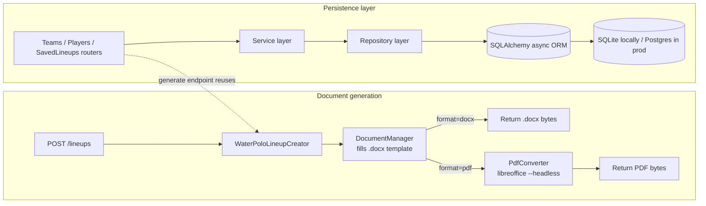
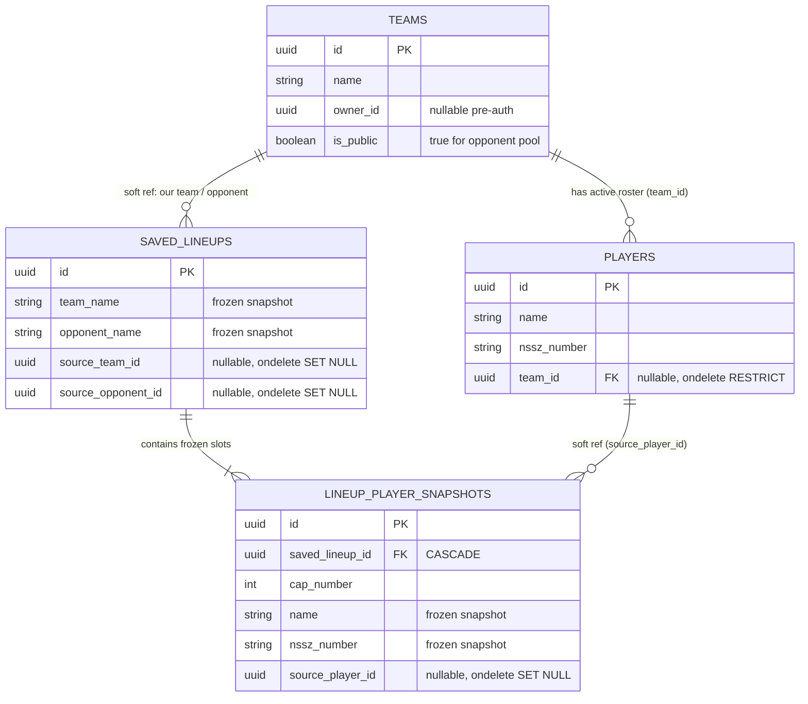
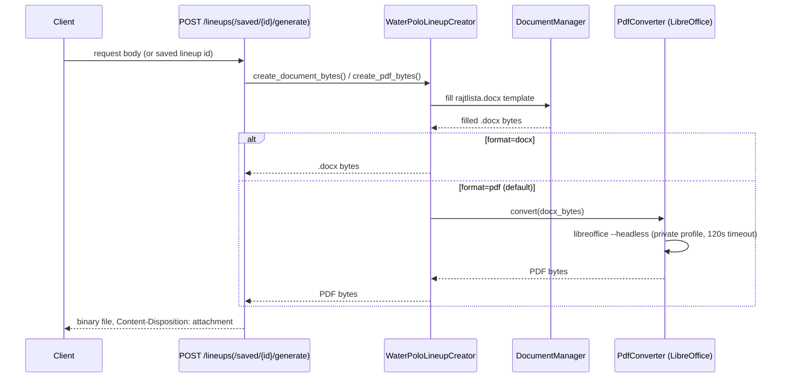

# Current State: Backend

The backend is a FastAPI application with two responsibilities: **generating lineup
documents** (the original feature) and **persisting Teams/Players/Saved Lineups** (added
later so lineups can be built from a saved roster instead of a one-off payload).

## Architecture

The persistence layer follows a consistent `schemas.py` / `repository.py` / `service.py` /
`router.py` layering per module (`lineup/teams/`, `lineup/players/`, `lineup/saved_lineups/`).

## API surface

### Document generation

`POST /lineups?format=pdf|docx` — fills the template, converts to PDF (default) or returns
DOCX directly, streams the file back with a `Content-Disposition: attachment` header.
Request body is `LineupRequest`: match, division, team_name, cap (`"Fehér"` or `"Kék"`),
date, coach, doctor, assistant_coach, team_leader, ball_thrower, and 1–15 players with
unique cap numbers 1–15.

### Teams

| Method | Path | Notes |
|---|---|---|
| `GET`/`POST` | `/teams` | Paginated CRUD |
| `GET` | `/teams/pool?search=&limit=` | Shared opponent pool — public teams only, plain list (not the paginated envelope). Registered *before* `/teams/{id}` so `"pool"` isn't swallowed as a path param |
| `GET`/`PUT`/`DELETE` | `/teams/{id}` | `DELETE` returns **409** if the team still has roster players (app-level check, not DB-level) |

### Players

| Method | Path | Notes |
|---|---|---|
| `GET`/`POST` | `/players` | `team_id` optional on create/update, filterable on list |
| `GET`/`PUT`/`DELETE` | `/players/{id}` | `DELETE` is **unconditionally safe (204)** — saved lineups are frozen snapshots, not live references, so deleting a player never blocks or breaks anything |

### Saved Lineups

| Method | Path | Notes |
|---|---|---|
| `GET`/`POST` | `/lineups/saved` | A saved lineup is a frozen snapshot (team/opponent name, per-player name/NSSZ) taken at creation time |
| `GET`/`DELETE` | `/lineups/saved/{id}` | |
| `POST` | `/lineups/saved/{id}/generate?format=pdf\|docx` | Renders the document from the snapshot |

Team/opponent/player can be supplied either as `source_*_id` (resolved from the live roster
at save time) or as free text — at least one of the two is required per field. Deleting the
source team/player afterwards never changes an already-saved lineup.

All paginated list endpoints (everything except `/teams/pool`) return the envelope
`{ "items": [...], "total": ..., "limit": ..., "offset": ... }`.

## Data model

**Snapshot vs. soft-reference strategy**: a `SavedLineup` freezes `team_name`/
`opponent_name`/`match_name` as plain text plus nullable soft FKs `source_team_id`/
`source_opponent_id` → `teams.id` (`ondelete="SET NULL"`); each `LineupPlayerSnapshot`
freezes `name`/`nssz_number`/`cap_number` plus a nullable soft FK `source_player_id` →
`players.id` (`ondelete="SET NULL"`). Rendering a lineup relies **only** on the frozen
fields — no joins to live tables — so editing or deleting master data never breaks history.
`Player.team_id` → `teams.id` uses `ondelete="RESTRICT"` at the DB level, but team deletion
is actually blocked earlier, at the service layer (409), so the DB-level RESTRICT never
fires in practice.

**Async loading gotcha**: `Team.players` and `SavedLineup.player_snapshots` are
`relationship(..., lazy="selectin")` — async SQLAlchemy can't lazy-load relationships
synchronously (raises `MissingGreenlet`), so eager `selectin` loading is required.

**SQLite foreign keys**: SQLite ignores `ondelete` clauses entirely unless
`PRAGMA foreign_keys=ON` is set per-connection — `enable_sqlite_foreign_keys(engine)` in
`lineup/db/engine.py` registers a connect-event listener that sets this pragma for both the
production and test engines. Without it, `SET NULL`/`RESTRICT` are silently inert.

## Document generation sequence

## Auth status

Pre-Auth: `user_id`/`owner_id` columns exist on every table but always resolve to `None`
until real auth is wired in (`lineup/auth/dependencies.py`'s `get_current_user_id()`). See
[[Roadmap: Backend]] for the planned cutover.
