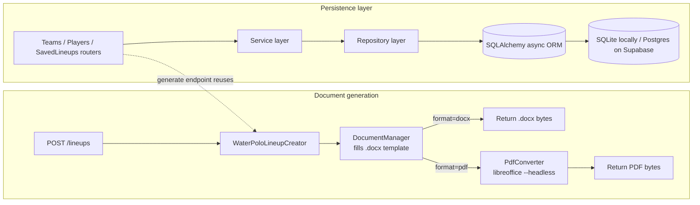
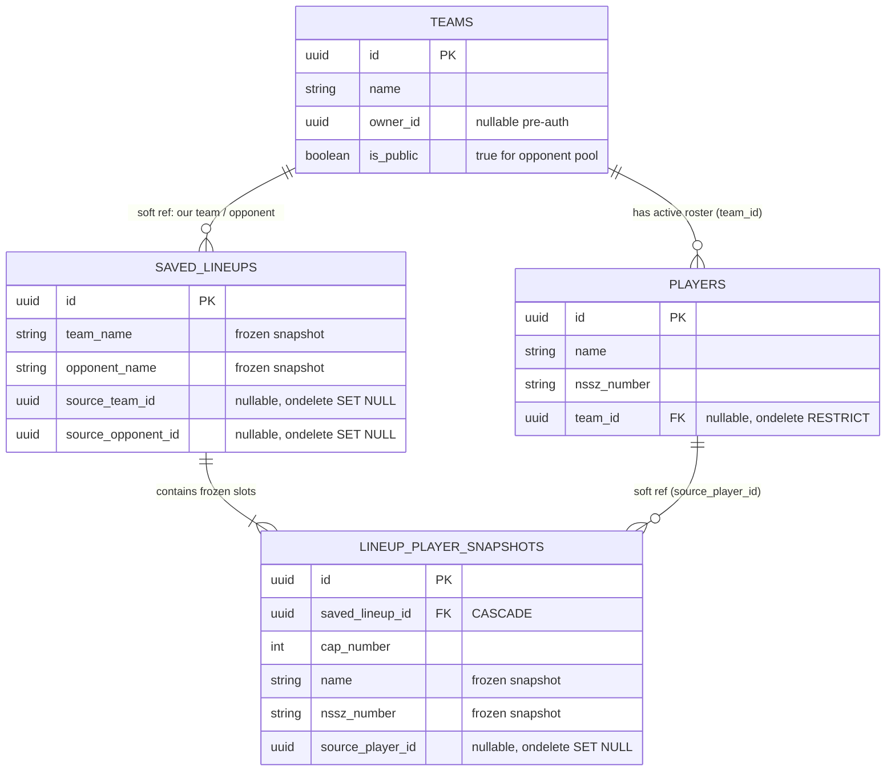
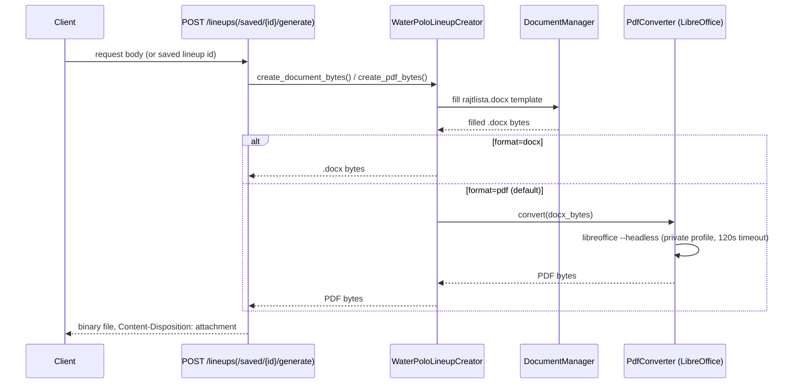

# Current State: Backend

The backend is a FastAPI application with two responsibilities: **generating lineup
documents** (the original feature) and **persisting Teams/Players/Saved Lineups** (added
later so lineups can be built from a saved roster instead of a one-off payload).

## Architecture

```mermaid
flowchart LR
    subgraph Document generation
        A[POST /lineups] --> B[WaterPoloLineupCreator]
        B --> C[DocumentManager<br/>fills .docx template]
        C -->|format=docx| D[Return .docx bytes]
        C -->|format=pdf| E[PdfConverter<br/>libreoffice --headless]
        E --> F[Return PDF bytes]
    end

    subgraph Persistence layer
        G[Teams / Players / SavedLineups routers] --> H[Service layer]
        H --> I[Repository layer]
        I --> J[(SQLAlchemy async ORM)]
        J --> K[(SQLite locally / Postgres on Supabase)]
    end

    G -.->|"generate" endpoint reuses| B
```

The persistence layer follows a consistent `schemas.py` / `repository.py` / `service.py` /
`router.py` layering per module (`lineup/teams/`, `lineup/players/`, `lineup/saved_lineups/`).
Each layer has one job, which is what keeps the code easy to follow:

| Layer | Job | Knows about |
|---|---|---|
| `router.py` | HTTP only: path, query params, status codes, dependency injection | FastAPI, `schemas.py`, `service.py` |
| `schemas.py` | Pydantic request/response shapes and input validation | Pydantic only |
| `service.py` | Business rules (e.g. "a team with players can't be deleted" → 409) | `repository.py` |
| `repository.py` | The only place that writes SQLAlchemy queries | the ORM models, the DB session |

A typical request, e.g. `POST /teams`: the router receives the JSON body (validated by the
schema), gets a DB session from `get_session()` and the caller's identity from
`get_current_user_id()` (both FastAPI dependencies), hands them to the service, which applies
business rules and calls the repository, which runs the SQL and returns ORM objects that the
router serialises back through the response schema.

### Entry points

- `app.py` — builds the FastAPI app, registers the four routers, optionally initialises Sentry,
  and (unless `ENV=production`) creates missing tables on startup.
- `main.py` — a small CLI that generates one hard-coded lineup to `resources/modified_rajtlista.docx`
  (`task run`); handy for trying the template without the API.
- `lineup/db/engine.py` — creates the async SQLAlchemy engine from `DATABASE_URL` (details
  under [Database engine & configuration](#database-engine--configuration)).
- `lineup/auth/dependencies.py` — the single auth seam, see [Auth status](#auth-status).

## API surface

### Document generation

`POST /lineups?format=pdf|docx` — fills the template, converts to PDF (default) or returns
DOCX directly, streams the file back with a `Content-Disposition: attachment` header.
Request body is `LineupRequest`: match, division, team_name, cap (`"Fehér"` or `"Kék"`),
date, coach, doctor, assistant_coach, team_leader, ball_thrower, and 1–15 players with
unique cap numbers 1–15.

Both generation endpoints (this one and `POST /lineups/saved/{id}/generate`) build a
`WaterPoloLineupDTO` and hand it to `build_file_response()` in `lineup/api/file_response.py`,
so rendering, headers and error handling live in one place:

- **Rendering runs in the threadpool** (`run_in_threadpool`). PDF conversion is a blocking
  LibreOffice subprocess that can take seconds; running it on the event loop would freeze
  every other request, including all the DB endpoints.
- **Filename header**: `rajtlista_<team>_<date>.<ext>`. HTTP header values are latin-1, so a
  team name with Hungarian `ő`/`ű` (or a `"`/`;`) can't go into a plain `filename="..."`. The
  header carries the real name in the RFC 6266 `filename*=UTF-8''...` form plus an
  accent-stripped ASCII `filename="..."` fallback for older clients.
- **Errors**: a LibreOffice timeout returns **504** `"PDF conversion timed out"`; any other
  rendering failure returns **500** `"Document generation failed"` (details go to the log).
- **Staff fields are optional at the document level**: only match, division, team name, cap,
  date and coach are required by `WaterPoloLineupDTOBuilder.build()`; a missing doctor /
  assistant coach / team leader / ball thrower renders as an empty line. `LineupRequest` still
  requires them for the one-off endpoint, but saved lineups may omit them.

### Teams

| Method | Path | Notes |
|---|---|---|
| `GET`/`POST` | `/teams` | Paginated CRUD |
| `GET` | `/teams/pool?search=&limit=` | Shared opponent pool — public teams only, plain list (not the paginated envelope), `limit` 1–100. Registered *before* `/teams/{id}` so `"pool"` isn't swallowed as a path param |
| `GET`/`PUT`/`DELETE` | `/teams/{id}` | `DELETE` returns **409** if the team still has roster players (app-level check, not DB-level) |

### Players

| Method | Path | Notes |
|---|---|---|
| `GET`/`POST` | `/players` | `team_id` optional on create/update, filterable on list |
| `GET`/`PUT`/`DELETE` | `/players/{id}` | `DELETE` is **unconditionally safe (204)** — saved lineups are frozen snapshots, not live references, so deleting a player never blocks or breaks anything |

### Saved Lineups

| Method | Path | Notes |
|---|---|---|
| `GET`/`POST` | `/lineups/saved` | A saved lineup is a frozen snapshot (team/opponent name, per-player name/NSSZ) taken at creation time |
| `GET`/`DELETE` | `/lineups/saved/{id}` | |
| `POST` | `/lineups/saved/{id}/generate?format=pdf\|docx` | Renders the document from the snapshot (same rendering/headers/errors as `POST /lineups`, see above) |

Team/opponent/player can be supplied either as `source_*_id` (resolved from the live roster
at save time) or as free text — at least one of the two is required per field. Deleting the
source team/player afterwards never changes an already-saved lineup.

All paginated list endpoints (everything except `/teams/pool`) return the envelope
`{ "items": [...], "total": ..., "limit": ..., "offset": ... }`.

## Data model

```mermaid
erDiagram
    TEAMS ||--o{ PLAYERS : "has active roster (team_id)"
    TEAMS ||--o{ SAVED_LINEUPS : "soft ref: our team / opponent"
    SAVED_LINEUPS ||--|{ LINEUP_PLAYER_SNAPSHOTS : "contains frozen slots"
    PLAYERS ||--o{ LINEUP_PLAYER_SNAPSHOTS : "soft ref (source_player_id)"

    TEAMS {
        uuid id PK
        string name
        uuid owner_id "nullable pre-auth"
        boolean is_public "true for opponent pool"
    }
    PLAYERS {
        uuid id PK
        string name
        string nssz_number
        uuid team_id FK "nullable, ondelete RESTRICT"
    }
    SAVED_LINEUPS {
        uuid id PK
        string team_name "frozen snapshot"
        string opponent_name "frozen snapshot"
        uuid source_team_id "nullable, ondelete SET NULL"
        uuid source_opponent_id "nullable, ondelete SET NULL"
    }
    LINEUP_PLAYER_SNAPSHOTS {
        uuid id PK
        uuid saved_lineup_id FK "CASCADE"
        int cap_number
        string name "frozen snapshot"
        string nssz_number "frozen snapshot"
        uuid source_player_id "nullable, ondelete SET NULL"
    }
```

**Snapshot vs. soft-reference strategy**: a `SavedLineup` freezes `team_name`/
`opponent_name`/`match_name` as plain text plus nullable soft FKs `source_team_id`/
`source_opponent_id` → `teams.id` (`ondelete="SET NULL"`); each `LineupPlayerSnapshot`
freezes `name`/`nssz_number`/`cap_number` plus a nullable soft FK `source_player_id` →
`players.id` (`ondelete="SET NULL"`). Rendering a lineup relies **only** on the frozen
fields — no joins to live tables — so editing or deleting master data never breaks history.
`Player.team_id` → `teams.id` uses `ondelete="RESTRICT"` at the DB level, but team deletion
is actually blocked earlier, at the service layer (409), so the DB-level RESTRICT never
fires in practice.

**Async loading gotcha**: `Team.players` and `SavedLineup.player_snapshots` are
`relationship(..., lazy="selectin")` — async SQLAlchemy can't lazy-load relationships
synchronously (raises `MissingGreenlet`), so eager `selectin` loading is required.

**SQLite foreign keys**: SQLite ignores `ondelete` clauses entirely unless
`PRAGMA foreign_keys=ON` is set per-connection — `enable_sqlite_foreign_keys(engine)` in
`lineup/db/engine.py` registers a connect-event listener that sets this pragma for both the
production and test engines. Without it, `SET NULL`/`RESTRICT` are silently inert. The listener
is only registered for SQLite URLs: `PRAGMA` is SQLite-only syntax and would fail every
connection on Postgres (Postgres enforces foreign keys natively).

## Database engine & configuration

`lineup/db/engine.py` builds one async SQLAlchemy engine from the `DATABASE_URL` environment
variable, defaulting to the file-backed local SQLite database `sqlite+aiosqlite:///./lineup.db`.
Nothing else in the app knows which database is behind it, so switching backends is purely a
configuration change.

| Setup | `DATABASE_URL` | Driver | Notes |
|---|---|---|---|
| Local / default | unset (or `sqlite+aiosqlite:///./lineup.db`) | `aiosqlite` | Tables auto-created on startup; tests use in-memory SQLite |
| Supabase (dev project `lineup-dev`), app runtime | `postgresql+asyncpg://postgres.<ref>:<pw>@aws-0-<region>.pooler.supabase.com:6543/postgres?ssl=require` | `asyncpg` | Supabase *transaction pooler* |
| Supabase, running Alembic | `postgresql+asyncpg://postgres:<pw>@db.<ref>.supabase.co:5432/postgres?ssl=require` | `asyncpg` | *Direct* connection (IPv6-only); on IPv4-only networks use the session-mode pooler (same host/user as above, port 5432) |

Why the Postgres URL looks the way it does:

- **Two connection flavors.** Supabase fronts Postgres with a pooler (Supavisor). In
  *transaction* mode (port 6543) it hands out a server connection per transaction, which is
  ideal for a web app but cannot run the DDL / advisory-lock operations Alembic needs — so
  migrations use the direct (or session-mode) connection instead.
- **Prepared statements off** — a transaction-mode pooler hands the same server connection to
  different clients from one transaction to the next, but asyncpg caches prepared statements
  per connection under auto-generated names. Two clients then collide on a name and the
  request fails with `DuplicatePreparedStatementError`. So for Postgres URLs
  `_make_engine_kwargs()` passes `connect_args` that disable asyncpg's own statement cache
  (`statement_cache_size=0`) and SQLAlchemy's (`prepared_statement_cache_size=0`), and give
  any statement that is still prepared a unique name (`prepared_statement_name_func`). These
  live in code, not the URL, because the naming function can't be expressed in a URL; an old
  URL that still ends in `&prepared_statement_cache_size=0` is harmless.
- **`ssl=require`** — Supabase enforces TLS.
- **`NullPool`** — for Postgres URLs `_make_engine_kwargs()` disables SQLAlchemy's own
  connection pool, because the Supabase pooler already pools and stacking a second pool on
  top causes stale/duplicated connections.
- **Naive UTC timestamps** — the `created_at` columns are `TIMESTAMP WITHOUT TIME ZONE`, so
  the model defaults produce naive UTC datetimes (`_utcnow()` in `lineup/db/models.py`).
  SQLite silently drops time zones, so an aware datetime worked there; asyncpg rejects it.
  Moving to `timestamptz` columns would be a possible future improvement (needs a migration).
- **`ENV=production`** — `app.py` skips `Base.metadata.create_all` on startup when this is set
  so Alembic is the only thing that touches the schema. Despite the name it means "the schema
  is Alembic-managed", **not** "this is the prod deployment": set it for any real Postgres,
  dev or prod — `ENV=production` is the correct value for the dev Supabase project too. (If it
  were left unset, the app would create the tables itself on first start, without an
  `alembic_version` record, and the next `task migrate` would fail with "table already
  exists".)
- **Why the app uses the pooler, not the direct connection.** Migrations are a separate,
  manual step (`task migrate`) — the app never runs them at startup — so the direct connection
  is only needed for that one-off command. The app stays on the transaction pooler because
  (1) the direct host is IPv6-only and would break the app on IPv4-only networks, (2) with
  `NullPool` every request opens a fresh connection, which is cheap through the pooler but slow
  and wasteful directly against Postgres, whose connection slots are limited, and (3) Supabase
  recommends the pooler for short-lived connections like a request-per-connection web app.

All variables are documented in `.env.example`. Docker Compose loads `.env` automatically and
passes `DATABASE_URL`/`ENV`/`SENTRY_DSN` into the container, and `task serve` sources `.env`
too. `task migrate` / `task migrate-new` deliberately do **not** read it: they target local
SQLite unless `DATABASE_URL` is passed for that single run, so a migration can never hit
Supabase by accident.

**Switching databases**: `task db:postgres` and `task db:sqlite` flip `.env` between the two
(uncomment/comment the real pooler `DATABASE_URL`, add/remove `ENV=production`), and
`task db:status` reports the active one. Restart `task serve` / run `task up` to apply.
Switching back to SQLite involves no code or data migration — the two databases are simply
independent. `db:postgres` refuses to run unless `.env` already holds a filled-in pooler URL
(port 6543, no `<placeholders>`).

### Changing the schema later (Alembic)

Routine schema changes work the same way on every backend:

1. Edit the SQLAlchemy models in `lineup/db/models.py`.
2. `task migrate-new -- -m "description"` — autogenerates a revision by diffing the models
   against the current database. Run it against the default local SQLite database so
   autogeneration doesn't need live Supabase access.
3. Review the generated file in `alembic/versions/` by hand — autogenerate is a starting point,
   not ground truth (it won't reliably infer `ondelete=` changes, for example).
4. `task migrate` applies it locally. To apply it to Supabase, run
   `DATABASE_URL="<direct URL>" task migrate` (the pooler can't run DDL). `task migrate-down`
   rolls back one revision.

### If database credentials are lost

Nothing here is a single point of failure as long as access to the Supabase account/org is
kept:

- **Database password lost** — Supabase dashboard → Project Settings → Database → *Reset
  database password*. No data is lost; update the password in your `.env` / deployment secrets.
- **API keys / JWT secret** — always re-viewable in Project Settings → Data API / JWT Settings,
  and rotatable if a leak is suspected (rotating the JWT secret invalidates issued tokens,
  which only matters once auth is wired in).
- **Losing access to the Supabase account/org itself** is the one unrecoverable case. Mitigate
  with a second org owner, plus the account recovery e-mail and 2FA backup codes stored
  safely.

### Portability: moving off Supabase later

Distinct from Alembic schema changes above — this is about changing the database engine or
hosting stack.

- **Another Postgres host** (RDS, Neon, Render, self-hosted…): the cheapest move. `DATABASE_URL`
  is the only coupling point in app code, so point it at the new host and run
  `alembic upgrade head` (or restore a `pg_dump`). Keep `NullPool` and
  the pooler-safe `connect_args` only if the new host also uses a transaction-mode pooler
  (any PgBouncer-style pooler needs them, not just Supabase); drop them for direct connections.
  The Supabase-flavoured parts arrive later with auth and RLS: `get_current_user_id()` would
  validate Supabase-issued JWTs (one function to swap), while RLS policies are plain Postgres
  SQL that carries over to any Postgres host.
- **A non-Postgres relational DB** (e.g. MySQL): swap the async driver (`asyncmy`/`aiomysql`
  instead of `asyncpg`), re-run the Alembic chain on the new engine to create the schema, and
  copy the data separately — Alembic moves DDL, not rows (read via the old engine, write via
  the new one). RLS has no equivalent in most other engines and would become application-level
  authorization checks.
- **Another cloud/hosting stack** while staying on Postgres: mostly ops. The container image
  and `compose.yml` are host-agnostic; the only real coupling is the auth JWT issuer and RLS.

## Document generation sequence

```mermaid
sequenceDiagram
    participant Client
    participant Router as POST /lineups(/saved/{id}/generate)
    participant Creator as WaterPoloLineupCreator
    participant Doc as DocumentManager
    participant PDF as PdfConverter (LibreOffice)

    Client->>Router: request body (or saved lineup id)
    Router->>Creator: create_document_bytes() / create_pdf_bytes()
    Creator->>Doc: fill rajtlista.docx template
    Doc-->>Creator: filled .docx bytes
    alt format=docx
        Creator-->>Router: .docx bytes
    else format=pdf (default)
        Creator->>PDF: convert(docx_bytes)
        PDF->>PDF: libreoffice --headless (private profile, 120s timeout)
        PDF-->>Creator: PDF bytes
        Creator-->>Router: PDF bytes
    end
    Router-->>Client: binary file, Content-Disposition: attachment
```

## Auth status

Pre-Auth: `user_id`/`owner_id` columns exist on every table but always resolve to `None`
until real auth is wired in (`lineup/auth/dependencies.py`'s `get_current_user_id()`). Every
repository already filters on `user_id` whenever it is non-`None`, so turning auth on later
means replacing that one function's body (to read the JWT `sub` claim) — no router or service
changes. Using Supabase Postgres for the database does **not** change this: the DB cutover and
the auth swap are independent, and the auth swap is deliberately sequenced after team
membership ships. See [[Roadmap: Backend]].
