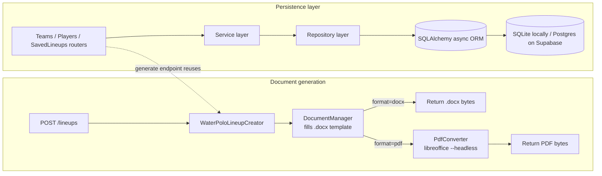
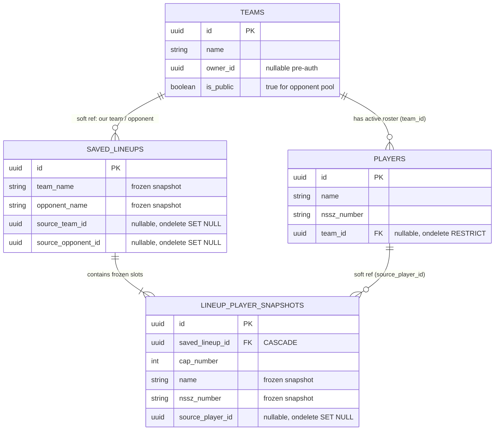
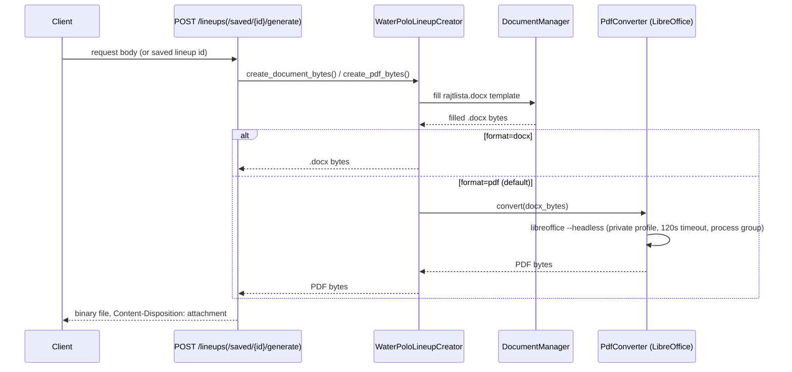

# Current State: Backend

The backend is a FastAPI application with two responsibilities: **generating lineup
documents** (the original feature) and **persisting Teams/Players/Saved Lineups** (added
later so lineups can be built from a saved roster instead of a one-off payload).

## Architecture

```mermaid
flowchart LR
    subgraph Document generation
        A[POST /lineups] --> B[WaterPoloLineupCreator]
        B --> C[DocumentManager<br/>fills .docx template]
        C -->|format=docx| D[Return .docx bytes]
        C -->|format=pdf| E[PdfConverter<br/>libreoffice --headless]
        E --> F[Return PDF bytes]
    end

    subgraph Persistence layer
        G[Teams / Players / SavedLineups routers] --> H[Service layer]
        H --> I[Repository layer]
        I --> J[(SQLAlchemy async ORM)]
        J --> K[(SQLite locally / Postgres on Supabase)]
    end

    G -.->|"generate" endpoint reuses| B
```

Paths on this page are relative to `backend/`, where all the Python lives (see
[[Current State: Everything Else]] for why Python commands run from there).

The persistence layer follows a consistent `schemas.py` / `repository.py` / `service.py` /
`router.py` layering per module (`lineup/teams/`, `lineup/players/`, `lineup/saved_lineups/`).
Each layer has one job, which is what keeps the code easy to follow:

| Layer | Job | Knows about |
|---|---|---|
| `router.py` | HTTP only: path, query params, status codes, dependency injection | FastAPI, `schemas.py`, `service.py` |
| `schemas.py` | Pydantic request/response shapes and input validation | Pydantic only |
| `service.py` | Business rules (e.g. "a team with players can't be deleted" → 409) | `repository.py` |
| `repository.py` | The only place that writes SQLAlchemy queries | the ORM models, the DB session |

A typical request, e.g. `POST /teams`: the router receives the JSON body (validated by the
schema), gets a DB session from `get_session()` and the caller's identity from
`get_current_user_id()` (both FastAPI dependencies), hands them to the service, which applies
business rules and calls the repository, which runs the SQL and returns ORM objects that the
router serialises back through the response schema.

### Entry points

- `app.py` — builds the FastAPI app, registers the four routers, optionally initialises Sentry,
  and (unless `ENV=production`) creates missing tables on startup.
- `main.py` — a small CLI that generates one hard-coded lineup to `resources/modified_rajtlista.docx`
  (`task run`); handy for trying the template without the API.
- `lineup/db/engine.py` — creates the async SQLAlchemy engine from `DATABASE_URL` (details
  under [Database engine & configuration](#database-engine--configuration)).
- `lineup/auth/dependencies.py` — the single auth seam, see [Auth status](#auth-status).

## API surface

### Document generation

`POST /lineups?format=pdf|docx` — fills the template, converts to PDF (default) or returns
DOCX directly, streams the file back with a `Content-Disposition: attachment` header.
Request body is `LineupRequest`: match, division, team_name, cap (`"Fehér"` or `"Kék"`),
date, coach, doctor, assistant_coach, team_leader, ball_thrower, and 1–15 players with
unique cap numbers 1–15.

Both generation endpoints (this one and `POST /lineups/saved/{id}/generate`) build a
`WaterPoloLineupDTO` and hand it to `build_file_response()` in `lineup/api/file_response.py`,
so rendering, headers and error handling live in one place:

- **Rendering runs in the threadpool** (`run_in_threadpool`). PDF conversion is a blocking
  LibreOffice subprocess that can take seconds; running it on the event loop would freeze
  every other request, including all the DB endpoints.
- **Filename header**: `rajtlista_<team>_<date>.<ext>`. HTTP header values are latin-1, so a
  team name with Hungarian `ő`/`ű` (or a `"`/`;`) can't go into a plain `filename="..."`. The
  header carries the real name in the RFC 6266 `filename*=UTF-8''...` form plus an
  accent-stripped ASCII `filename="..."` fallback for older clients.
- **Errors**: a LibreOffice timeout returns **504** `"PDF conversion timed out"`; any other
  rendering failure returns **500** `"Document generation failed"` (details go to the log).
- **Concurrency limit**: every PDF is a separate LibreOffice process (a few hundred MB each), so a burst
  of requests could exhaust a small machine's memory. A semaphore (`PDF_MAX_CONCURRENT`, default 2)
  lets that many conversions run at once; a request that can't get a slot within 10 s gets **503**
  `"PDF conversion is busy, try again shortly"` with `Retry-After: 5`. DOCX requests never wait.
- **Timeouts kill the whole process group**: LibreOffice runs in its own process group, and on the
  120 s timeout the group is killed with `SIGKILL`. Killing only the launcher (what `subprocess.run`
  does) would leave `soffice.bin` running and holding its memory after the client already got a 504.
- **Template path** is resolved from the source file's location, not the working directory, so the
  template is found whether the process starts in `backend/`, in the container or under pytest.
- **Staff fields are optional at the document level**: only match, division, team name, cap,
  date and coach are required by `WaterPoloLineupDTOBuilder.build()`; a missing doctor /
  assistant coach / team leader / ball thrower renders as an empty line. `LineupRequest` still
  requires them for the one-off endpoint, but saved lineups may omit them.

### Health

| Method | Path | Notes |
|---|---|---|
| `GET` | `/health` | Liveness: `200 {"status":"ok"}`, never touches the database. Used by the container healthcheck, CD and the frontend's "server is waking up" banner |
| `GET` | `/health?db=1` | Readiness: also runs `SELECT 1`. A failure returns `503 {"status":"unavailable"}` (no driver text, so hostnames never leak). It is returned rather than raised, so a down database does not flood Sentry |

### Teams

| Method | Path | Notes |
|---|---|---|
| `GET`/`POST` | `/teams` | Paginated CRUD |
| `GET` | `/teams/pool?search=&limit=` | Shared opponent pool — public teams only, plain list (not the paginated envelope), `limit` 1–100. Registered *before* `/teams/{id}` so `"pool"` isn't swallowed as a path param |
| `GET`/`PUT`/`DELETE` | `/teams/{id}` | `DELETE` returns **409** if the team still has roster players (app-level check, not DB-level) |

### Players

| Method | Path | Notes |
|---|---|---|
| `GET`/`POST` | `/players` | `team_id` optional on create/update, filterable on list. An unknown `team_id` is a **404** `Team not found` on both create and update |
| `GET`/`PUT`/`DELETE` | `/players/{id}` | `DELETE` is **unconditionally safe (204)** — saved lineups are frozen snapshots, not live references, so deleting a player never blocks or breaks anything |

### Saved Lineups

| Method | Path | Notes |
|---|---|---|
| `GET`/`POST` | `/lineups/saved` | A saved lineup is a frozen snapshot (team/opponent name, per-player name/NSSZ) taken at creation time |
| `GET`/`DELETE` | `/lineups/saved/{id}` | |
| `POST` | `/lineups/saved/{id}/generate?format=pdf\|docx` | Renders the document from the snapshot (same rendering/headers/errors as `POST /lineups`, see above) |

Team/opponent/player can be supplied either as `source_*_id` (resolved from the live roster
at save time) or as free text — **exactly one** of the two per field. Sending both is a `422`: before
this rule, free text silently overrode the roster value, which hid typos. The same NSSZ number can't
appear twice in a lineup (`422`); on saved lineups this is checked on the *resolved* numbers, since a
roster player's number is only known after the lookup. Deleting the source team/player afterwards
never changes an already-saved lineup.

### Input rules

All text goes through the shared types in `lineup/common/types.py`:

- trimmed, not empty after trimming, and capped in length;
- no control characters. python-docx refuses them (that was a 500 on `/lineups`, and a saved lineup
  that could be stored but never generated), and a tab or newline would be written into the document
  as a real tab or line break, shifting the layout;
- optional fields treat a blank value as "not provided" (`None`) rather than storing an empty string.

If a constraint violation still slips past the service checks (for example the team is deleted between
the existence check and the commit), `lineup/common/errors.py` turns the `IntegrityError` into a `409`
instead of a 500. It logs only exception class names: SQLAlchemy's message contains the SQL parameters,
which are names and NSSZ numbers.

### Ordering

Page boundaries only mean something if the order is deterministic, and Postgres doesn't promise a row
order without `ORDER BY`. Teams (and the pool) are ordered by `(name, id)`, players and saved lineups by
`(created_at, id)`. A saved lineup's players are always sorted by cap number, including on the response
to `POST` (the ORM's identity map would otherwise hand back the request order).

All paginated list endpoints (everything except `/teams/pool`) return the envelope
`{ "items": [...], "total": ..., "limit": ..., "offset": ... }`. `limit` must be 1–200 (default 20):
an unbounded list is a cheap way to make the API dump a whole table, so there is no "all" mode.
Page with `offset` instead. The pool's `search` term is matched literally (`%` and `_` are escaped),
so typing `100%` finds "100% Club" rather than everything.

**Input limits**: every string on `POST /lineups` has a `max_length` (match/name/staff 200, team 120,
division 100, date 50, NSSZ 50), the same limits the saved-lineup schemas already used.

**CORS**: a browser only lets a page call this API from another origin if the API allows it. Set
`CORS_ORIGINS` to a comma-separated list of exact origins (the Vite dev server, the deployed
frontend). Unset means no CORS headers at all. `*` is refused at startup, credentials are off (the
future sign-in uses an `Authorization` header, not cookies), and only `GET/POST/PUT/DELETE` plus the
`Authorization` and `Content-Type` headers are allowed. `Content-Disposition` is exposed so the
frontend can read the download file name.

## Data model

```mermaid
erDiagram
    TEAMS ||--o{ PLAYERS : "has active roster (team_id)"
    TEAMS ||--o{ SAVED_LINEUPS : "soft ref: our team / opponent"
    SAVED_LINEUPS ||--|{ LINEUP_PLAYER_SNAPSHOTS : "contains frozen slots"
    PLAYERS ||--o{ LINEUP_PLAYER_SNAPSHOTS : "soft ref (source_player_id)"

    TEAMS {
        uuid id PK
        string name
        uuid owner_id "nullable pre-auth"
        boolean is_public "true for opponent pool"
    }
    PLAYERS {
        uuid id PK
        string name
        string nssz_number
        uuid team_id FK "nullable, ondelete RESTRICT"
    }
    SAVED_LINEUPS {
        uuid id PK
        string team_name "frozen snapshot"
        string opponent_name "frozen snapshot"
        uuid source_team_id "nullable, ondelete SET NULL"
        uuid source_opponent_id "nullable, ondelete SET NULL"
    }
    LINEUP_PLAYER_SNAPSHOTS {
        uuid id PK
        uuid saved_lineup_id FK "CASCADE"
        int cap_number
        string name "frozen snapshot"
        string nssz_number "frozen snapshot"
        uuid source_player_id "nullable, ondelete SET NULL"
    }
```

**Snapshot vs. soft-reference strategy**: a `SavedLineup` freezes `team_name`/
`opponent_name`/`match_name` as plain text plus nullable soft FKs `source_team_id`/
`source_opponent_id` → `teams.id` (`ondelete="SET NULL"`); each `LineupPlayerSnapshot`
freezes `name`/`nssz_number`/`cap_number` plus a nullable soft FK `source_player_id` →
`players.id` (`ondelete="SET NULL"`). Rendering a lineup relies **only** on the frozen
fields — no joins to live tables — so editing or deleting master data never breaks history.
`Player.team_id` → `teams.id` uses `ondelete="RESTRICT"` at the DB level, but team deletion
is actually blocked earlier, at the service layer (409), so the DB-level RESTRICT never
fires in practice.

**Async loading gotcha**: `Team.players` and `SavedLineup.player_snapshots` are
`relationship(..., lazy="selectin")` — async SQLAlchemy can't lazy-load relationships
synchronously (raises `MissingGreenlet`), so eager `selectin` loading is required.

**SQLite foreign keys**: SQLite ignores `ondelete` clauses entirely unless
`PRAGMA foreign_keys=ON` is set per-connection — `enable_sqlite_foreign_keys(engine)` in
`lineup/db/engine.py` registers a connect-event listener that sets this pragma for both the
production and test engines. Without it, `SET NULL`/`RESTRICT` are silently inert. The listener
is only registered for SQLite URLs: `PRAGMA` is SQLite-only syntax and would fail every
connection on Postgres (Postgres enforces foreign keys natively).

## Database engine & configuration

`lineup/db/engine.py` builds one async SQLAlchemy engine from the `DATABASE_URL` environment
variable, defaulting to the file-backed local SQLite database `sqlite+aiosqlite:///./lineup.db`.
Nothing else in the app knows which database is behind it, so switching backends is purely a
configuration change.

| Setup | `DATABASE_URL` | Driver | Notes |
|---|---|---|---|
| Local / default | unset (or `sqlite+aiosqlite:///./lineup.db`) | `aiosqlite` | Tables auto-created on startup; tests use in-memory SQLite |
| Supabase (dev project `lineup-dev`), app runtime | `postgresql+asyncpg://postgres.<ref>:<pw>@aws-0-<region>.pooler.supabase.com:6543/postgres?ssl=require` | `asyncpg` | Supabase *transaction pooler* |
| Supabase, running Alembic | `postgresql+asyncpg://postgres:<pw>@db.<ref>.supabase.co:5432/postgres?ssl=require` | `asyncpg` | *Direct* connection (IPv6-only); on IPv4-only networks use the session-mode pooler (same host/user as above, port 5432) |

Why the Postgres URL looks the way it does:

- **Two connection flavors.** Supabase fronts Postgres with a pooler (Supavisor). In
  *transaction* mode (port 6543) it hands out a server connection per transaction, which is
  ideal for a web app but cannot run the DDL / advisory-lock operations Alembic needs — so
  migrations use the direct (or session-mode) connection instead.
- **Prepared statements off** — a transaction-mode pooler hands the same server connection to
  different clients from one transaction to the next, but asyncpg caches prepared statements
  per connection under auto-generated names. Two clients then collide on a name and the
  request fails with `DuplicatePreparedStatementError`. So for Postgres URLs
  `_make_engine_kwargs()` passes `connect_args` that disable asyncpg's own statement cache
  (`statement_cache_size=0`) and SQLAlchemy's (`prepared_statement_cache_size=0`), and give
  any statement that is still prepared a unique name (`prepared_statement_name_func`). These
  live in code, not the URL, because the naming function can't be expressed in a URL; an old
  URL that still ends in `&prepared_statement_cache_size=0` is harmless.
- **`ssl=require`** — Supabase enforces TLS.
- **`NullPool`** — for Postgres URLs `_make_engine_kwargs()` disables SQLAlchemy's own
  connection pool, because the Supabase pooler already pools and stacking a second pool on
  top causes stale/duplicated connections.
- **Naive UTC timestamps** — the `created_at` columns are `TIMESTAMP WITHOUT TIME ZONE`, so
  the model defaults produce naive UTC datetimes (`_utcnow()` in `lineup/db/models.py`).
  SQLite silently drops time zones, so an aware datetime worked there; asyncpg rejects it.
  Moving to `timestamptz` columns would be a possible future improvement (needs a migration).
- **`ENV=production`** — `app.py` skips `Base.metadata.create_all` on startup when this is set
  so Alembic is the only thing that touches the schema. Despite the name it means "the schema
  is Alembic-managed", **not** "this is the prod deployment": set it for any real Postgres,
  dev or prod — `ENV=production` is the correct value for the dev Supabase project too. (If it
  were left unset, the app would create the tables itself on first start, without an
  `alembic_version` record, and the next `task migrate` would fail with "table already
  exists".)
- **Why the app uses the pooler, not the direct connection.** Migrations are a separate,
  manual step (`task migrate`) — the app never runs them at startup — so the direct connection
  is only needed for that one-off command. The app stays on the transaction pooler because
  (1) the direct host is IPv6-only and would break the app on IPv4-only networks, (2) with
  `NullPool` every request opens a fresh connection, which is cheap through the pooler but slow
  and wasteful directly against Postgres, whose connection slots are limited, and (3) Supabase
  recommends the pooler for short-lived connections like a request-per-connection web app.

All variables are documented in `backend/.env.example`. Docker Compose loads `backend/.env` (via `env_file` in the root `compose.yml`) and
passes `DATABASE_URL`/`ENV`/`SENTRY_DSN` into the container, and `task serve` sources `backend/.env`
too. `task migrate` / `task migrate-new` deliberately do **not** read it: they target local
SQLite unless `DATABASE_URL` is passed for that single run, so a migration can never hit
Supabase by accident.

**Switching databases**: `task db:postgres` and `task db:sqlite` flip `backend/.env` between the two
(uncomment/comment the real pooler `DATABASE_URL`, add/remove `ENV=production`), and
`task db:status` reports the active one. Restart `task serve` / run `task up` to apply.
Switching back to SQLite involves no code or data migration — the two databases are simply
independent. `db:postgres` refuses to run unless `backend/.env` already holds a filled-in pooler URL
(port 6543, no `<placeholders>`).

### Changing the schema later (Alembic)

Routine schema changes work the same way on every backend:

1. Edit the SQLAlchemy models in `lineup/db/models.py`.
2. `task migrate-new -- -m "description"` — autogenerates a revision by diffing the models
   against the current database. Run it against the default local SQLite database so
   autogeneration doesn't need live Supabase access.
3. Review the generated file in `alembic/versions/` by hand — autogenerate is a starting point,
   not ground truth (it won't reliably infer `ondelete=` changes, for example).
4. `task migrate` applies it locally. To apply it to Supabase, put the owner's direct (or
   session-pooler) URL in `backend/.env.migrate` as `MIGRATE_DATABASE_URL` and run
   `task migrate:supabase` (the transaction pooler can't run DDL). `task migrate-down` rolls back
   one revision.
5. `task migrate-check` (CI runs it too) applies every migration to a throwaway SQLite file and then
   runs `alembic check`, which fails if the models still differ from what the migrations produce. So
   forgetting step 2 fails the build instead of surfacing when someone next migrates Supabase.
   SQLite reflects `UUID` columns as `NUMERIC`, so `alembic/env.py` skips *type* comparison there (column,
   nullability and foreign-key drift are still caught); CI's Postgres job compares types for real.

### Database roles and Row Level Security

The `rls_and_least_privilege_role` migration (Postgres only; a no-op on SQLite) is what makes the
database safe to put behind a public API. It does four things:

1. **RLS on every `public` table**, including `alembic_version`. With RLS on and no policy, every role
   except the table owner is denied by default. (On 2026-10-02 this had been done by hand on the dev
   project; the migration makes it reproducible.)
2. **`anon` / `authenticated` lose everything.** Those are Supabase's Data API roles; we keep the Data
   API off, and this guarantees that turning it on by mistake still exposes nothing. Default privileges
   are revoked too, so tables created later don't come pre-granted to them. (The statements are
   guarded, because plain Postgres in CI has no such roles.)
3. **An event trigger** (`lineup_enable_rls`) switches RLS on for every table created in `public` from
   now on, so a forgotten `ENABLE ROW LEVEL SECURITY` in a future migration can't leave a table open.
   Event triggers normally need a superuser; if the hosting role isn't allowed to create one the
   migration logs a notice and continues, and CI's "every table has RLS" assertion still protects
   you. The function's `search_path` is pinned to empty (a follow-up migration, after Supabase's
   Security Advisor flagged it); it only uses `pg_catalog` functions, which are always searched.
4. **The `lineup_app` role**: not the owner (so RLS applies to it), `NOBYPASSRLS`, no `CREATE` on the
   schema, `SELECT/INSERT/UPDATE/DELETE` on the four app tables only (not on `alembic_version`, so a
   compromised API can't rewrite the migration history) and the same default privileges on future
   tables. An interim policy `app_all ... USING (true)` lets the API through, because the API is the
   only client; #21 replaces it with team-scoped policies. A new table therefore starts out *denied*
   to the app until its migration adds a policy.

Why not just connect as `postgres`? It owns the tables, so it **bypasses RLS**, can drop them, and can
read other schemas such as `auth.*`. A SQL-injection bug or a leaked `DATABASE_URL` would then be
total. As `lineup_app` the worst case is bounded to the app's own tables.

**Two credentials, two files.** The owner's URL (`MIGRATE_DATABASE_URL`, direct or session-pooler
connection) lives in the separate, git-ignored `backend/.env.migrate`. It must not go into
`backend/.env`, because Docker Compose and `task serve` load that file into the API's environment and
the API must never hold the owner's password. `alembic/env.py` prefers `MIGRATE_DATABASE_URL` over
`DATABASE_URL`, and `task migrate:supabase` reads only `.env.migrate`. The migration URL may be the plain
`postgresql://` string the Supabase dashboard shows: `lineup/db/urls.py` rewrites it to the `asyncpg` driver
(the only one installed), and `sslmode=` to `ssl=`. The app's own `DATABASE_URL` must still say `postgresql+asyncpg://`.

**Rolling it out on a Supabase project** (shared state; do it deliberately):

1. `task migrate:supabase` applies the migration as the owner.
2. `task db:create-app-role` gives `lineup_app` a generated password and rewrites the pooler
   `DATABASE_URL` in `backend/.env` to `lineup_app.<project-ref>` (user and password only; nothing is
   printed, and on any failure only the exception class is shown because driver messages can quote the
   statement).
3. Restart the app and run the `supabase-smoke` skill: create and delete a team, player and saved
   lineup as `lineup_app`.

Expect two notes in Supabase's Security Advisor: an INFO `rls_enabled_no_policy` on `alembic_version`
is intended (RLS with no policy denies everyone but the owner, which is exactly what we want for the
migration history), and the `search_path` WARN on the trigger function is fixed by the follow-up
migration.

`tests/test_postgres_migrations.py` proves all of the above against a real Postgres (skipped unless
`POSTGRES_TEST_URL` is set; CI's "Migrations (Postgres)" job sets it): every table has RLS, the trigger
exists and protects a table created later, `lineup_app` can do DML through RLS but not touch
`alembic_version` or create objects, `anon`/`authenticated` reach nothing, and the generated password
really logs in.

### If database credentials are lost

Nothing here is a single point of failure as long as access to the Supabase account/org is
kept:

- **Database password lost** — Supabase dashboard → Project Settings → Database → *Reset
  database password*. No data is lost; update the password in your `backend/.env` / deployment secrets.
- **API keys / JWT secret** — always re-viewable in Project Settings → Data API / JWT Settings,
  and rotatable if a leak is suspected (rotating the JWT secret invalidates issued tokens,
  which only matters once auth is wired in).
- **Losing access to the Supabase account/org itself** is the one unrecoverable case. Mitigate
  with a second org owner, plus the account recovery e-mail and 2FA backup codes stored
  safely.

### Portability: moving off Supabase later

Distinct from Alembic schema changes above — this is about changing the database engine or
hosting stack.

- **Another Postgres host** (RDS, Neon, Render, self-hosted…): the cheapest move. `DATABASE_URL`
  is the only coupling point in app code, so point it at the new host and run
  `alembic upgrade head` (or restore a `pg_dump`). Keep `NullPool` and
  the pooler-safe `connect_args` only if the new host also uses a transaction-mode pooler
  (any PgBouncer-style pooler needs them, not just Supabase); drop them for direct connections.
  The Supabase-flavoured parts arrive later with auth and RLS: `get_current_user_id()` would
  validate Supabase-issued JWTs (one function to swap), while RLS policies are plain Postgres
  SQL that carries over to any Postgres host.
- **A non-Postgres relational DB** (e.g. MySQL): swap the async driver (`asyncmy`/`aiomysql`
  instead of `asyncpg`), re-run the Alembic chain on the new engine to create the schema, and
  copy the data separately — Alembic moves DDL, not rows (read via the old engine, write via
  the new one). RLS has no equivalent in most other engines and would become application-level
  authorization checks.
- **Another cloud/hosting stack** while staying on Postgres: mostly ops. The container image
  and `compose.yml` are host-agnostic; the only real coupling is the auth JWT issuer and RLS.

## Document generation sequence

```mermaid
sequenceDiagram
    participant Client
    participant Router as POST /lineups(/saved/{id}/generate)
    participant Creator as WaterPoloLineupCreator
    participant Doc as DocumentManager
    participant PDF as PdfConverter (LibreOffice)

    Client->>Router: request body (or saved lineup id)
    Router->>Creator: create_document_bytes() / create_pdf_bytes()
    Creator->>Doc: fill rajtlista.docx template
    Doc-->>Creator: filled .docx bytes
    alt format=docx
        Creator-->>Router: .docx bytes
    else format=pdf (default)
        Creator->>PDF: convert(docx_bytes)
        PDF->>PDF: libreoffice --headless (private profile, 120s timeout, process group)
        PDF-->>Creator: PDF bytes
        Creator-->>Router: PDF bytes
    end
    Router-->>Client: binary file, Content-Disposition: attachment
```

## Auth status

Pre-Auth: `user_id`/`owner_id` columns exist on every table but always resolve to `None`
until real auth is wired in (`lineup/auth/dependencies.py`'s `get_current_user_id()`). Every
repository already filters on `user_id` whenever it is non-`None`, so turning auth on later
means replacing that one function's body (to read the JWT `sub` claim) — no router or service
changes. Using Supabase Postgres for the database does **not** change this: the DB cutover and
the auth swap are independent, and the auth swap is deliberately sequenced after team
membership ships. See [[Roadmap: Backend]].
