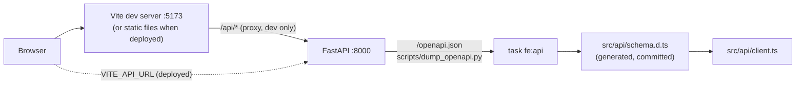

# Current State: Frontend

The web app lives in `frontend/` and is a **skeleton**: the tooling, the theme, the app shell and
the generated API client are in place, and the three areas of the navigation (Lineup, Roster,
Saved) are still "coming soon" pages. The screens arrive phase by phase (see [[Roadmap: Frontend]]
and `PLAN.md`). The backend it talks to is described in [[Current State: Backend]].

## How it is built

| Concern | Choice | Why |
|---|---|---|
| Language and UI | React 19 + TypeScript, built by Vite | Mainstream, fast dev server, one static bundle to host |
| Styling | Tailwind CSS v4 with the **Polaris** theme (`frontend/DESIGN.md`) as CSS variables in `src/index.css`, light and dark | Components use semantic tokens (`bg-primary`) and never raw colors, so the theme can change in one file |
| Components | shadcn-style, copied into `src/components/ui/` (Button, Card) on Radix primitives | We own the code and can keep Polaris's square corners |
| Routing | React Router (`src/app.tsx`) | Client-side navigation; `/`, `/roster`, `/saved` |
| Server data | TanStack Query provider is mounted; the cold-start-aware layer is the next step | The hosted API scales to zero, so loading and retrying need to be designed in |
| API client | `openapi-fetch` over types generated by `openapi-typescript` from the backend's OpenAPI spec | A changed endpoint turns into a compile error instead of a runtime surprise |
| Tests | Vitest + Testing Library (jsdom) | Same runner as Vite, no browser needed for unit tests |
| Tooling | pnpm (pinned by `packageManager`), ESLint, Prettier, TypeScript pinned to 6.0 (typescript-eslint doesn't support 7 yet) | `task fe:*` wraps all of it |

### The app shell

`src/components/app-shell.tsx` is the frame every page sits in: a **sidebar on desktop** and a
**top bar plus bottom navigation on phones** (the switch is Tailwind's `md` breakpoint). It is
plain static markup, so it renders immediately even when the API is asleep. Both navigations come
from one list (`src/components/nav-items.ts`). The dark theme is a `dark` class on `<html>`, set
before first paint by `public/theme-init.js` (a separate file instead of an inline script, so a
strict Content-Security-Policy stays possible) and remembered in localStorage.

### The generated API client

`task fe:api` dumps the OpenAPI spec straight from the FastAPI app (no server needed) into
`src/api/openapi.json` and generates `src/api/schema.d.ts` from it. Both are committed, so API
changes show up in review, and `task fe:api:check` (run by CI) fails when they are stale. In dev
the client calls the same-origin `/api`, which Vite proxies to the container on `:8000`, so no CORS
configuration is needed locally; a deployed build sets `VITE_API_URL`.

### Privacy by construction

The font (Google Sans Flex) is self-hosted through Fontsource and nothing is loaded from a third
party, so a visitor's IP address never goes to Google Fonts. Everything in `frontend/.env*` that
starts with `VITE_` is public, so only public values belong there. The remaining browser-side
baseline (CSP and security headers, no trackers, clearing data on sign-out) is tracked in #97.

## CI and dependencies

A `Frontend` job in `ci.yml` runs lint + format check, type check, unit tests, the build and the
API-client freshness check on every PR; Dependabot watches `frontend/package.json` (`npm`
ecosystem). Details are in [[Current State: Everything Else]].

## Not built yet

Sign-in, the lineup form, roster screens, saved-lineup previews, Cloudflare Pages deployment and
browser (Playwright) tests. See [[Roadmap: Frontend]].
