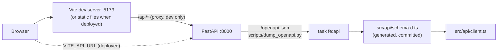

# Current State: Frontend

The web app lives in `frontend/`. The tooling, the theme, the app shell, the generated API client
and the cold-start handling are in place, and so are **Google sign-in** (through Supabase Auth)
and the first-run **team onboarding**. Behind the sign-in sits the **one-off lineup form** on `/`
(Lineup); the other two areas of the navigation (Roster, Saved) are still "coming soon" pages. The screens arrive phase by phase (see [[Roadmap: Frontend]]
and `PLAN.md`). The backend it talks to is described in [[Current State: Backend]].

## How it is built

| Concern | Choice | Why |
|---|---|---|
| Language and UI | React 19 + TypeScript, built by Vite | Mainstream, fast dev server, one static bundle to host |
| Styling | Tailwind CSS v4 with the **Polaris** theme (`frontend/DESIGN.md`) as CSS variables in `src/index.css`, light and dark | Components use semantic tokens (`bg-primary`) and never raw colors, so the theme can change in one file |
| Components | shadcn-style, copied into `src/components/ui/` (Button, Card, Skeleton) on Radix primitives | We own the code and can keep Polaris's square corners |
| Routing | React Router (`src/app.tsx`) | Client-side navigation; `/sign-in` is public, `/`, `/roster`, `/saved` need a signed-in user |
| Sign-in | `@supabase/supabase-js`, for sign-in only | Supabase Auth runs the Google flow; the browser never queries Supabase's Data API, every piece of data goes through our API, which checks the token |
| Forms | React Hook Form + a Zod schema (`src/features/lineup/schema.ts`) | Validation runs in the browser first, with the same limits as the API, so a slow request is not wasted on input the API would reject |
| Server data | TanStack Query with a shared retry policy, plus a backend-status check that runs on load (see *Cold starts* below) | The hosted API scales to zero, so the first request after idle is slow and loading and retrying are designed in from the start |
| API client | `openapi-fetch` over types generated by `openapi-typescript` from the backend's OpenAPI spec | A changed endpoint turns into a compile error instead of a runtime surprise |
| Tests | Vitest + Testing Library (jsdom) | Same runner as Vite, no browser needed for unit tests |
| Tooling | pnpm (pinned by `packageManager`), ESLint, Prettier, TypeScript pinned to 6.0 (typescript-eslint doesn't support 7 yet) | `task fe:*` wraps all of it |

### The app shell

`src/components/app-shell.tsx` is the frame every page sits in: a **sidebar on desktop** and a
**top bar plus bottom navigation on phones** (the switch is Tailwind's `md` breakpoint). It is
plain static markup, so it renders immediately even when the API is asleep. Both navigations come
from one list (`src/components/nav-items.ts`). The dark theme is a `dark` class on `<html>`, set
before first paint by `public/theme-init.js` (a separate file instead of an inline script, so a
strict Content-Security-Policy stays possible) and remembered in localStorage.

### The generated API client

`task fe:api` dumps the OpenAPI spec straight from the FastAPI app (no server needed) into
`src/api/openapi.json` and generates `src/api/schema.d.ts` from it. Both are committed, so API
changes show up in review, and `task fe:api:check` (run by CI) fails when they are stale. In dev
the client calls the same-origin `/api`, which Vite proxies to the container on `:8000`, so no CORS
configuration is needed locally; a deployed build sets `VITE_API_URL`.

### Cold starts

The API runs on free hosting that stops the machine when idle, so the first request after a break
takes a few seconds (and the first PDF longer). The UI is built so that never looks like a bug:

- **Static first.** The shell, navigation and headings are plain markup and render immediately.
  Every list or panel that needs data is its own `QueryBoundary` (`src/components/query-boundary.tsx`)
  with a `Skeleton` in the final shape of the content, so regions fill in independently. Buttons
  that start a request take `loading`, which shows a spinner and disables them so a slow save
  can't be submitted twice.
- **Wake-up check.** `BackendStatusProvider` (`src/backend-status/`) calls `GET /health` the moment
  the app loads, before any sign-in, which already starts a sleeping machine booting. It moves
  through `unknown -> waking -> ready`, or to `db-paused` / `down`:

  | State | Meaning | What the user sees |
  |---|---|---|
  | `unknown` | first check under ~1.5 s old | nothing |
  | `waking` | no answer after 1.5 s | amber banner "The server is starting up ..." with elapsed seconds (behind `VITE_COLD_START_NOTICE`, on unless set to `false`) |
  | `ready` | `/health` answered 200 | nothing |
  | `db-paused` | `/health` answered but `/health?db=true` returned 503 | banner: the database is paused (free tier) and someone must resume it |
  | `down` | no answer after ~60 s, or a non-retryable answer (e.g. 404 from a wrong API URL) | red banner with a "Try again" button |

  Liveness is polled with growing pauses (1 s, 2 s, 3 s, then 5 s) and only network errors and
  502/503/504 are retried. The readiness (`?db=true`) check runs once, after the API answered, and
  never blocks the UI.
- **Retries for data.** `createQueryClient()` (`src/api/query-client.ts`) retries queries only for
  transient failures (`isTransient`: no response, or 502/503/504) with 1 s, 2 s, 4 s, then 8 s
  backoff, about 47 s in total. A 4xx is never retried, and neither are mutations: repeating a
  save or a PDF render the user did not ask for twice is worse than an error message.
- **Timeouts.** Every call gets a 60 s timeout (`DEFAULT_TIMEOUT_MS`) so a hung connection ends;
  PDF generation uses 130 s (`PDF_TIMEOUT_MS`), above the backend's 120 s LibreOffice limit.
- **Errors in plain words.** `ApiError` carries the status; `describeError()` turns it into a short
  generic sentence. Server error text is never shown or logged, since it can contain hostnames or
  personal data.

### Sign-in, the token and teams

```mermaid
sequenceDiagram
    participant U as User
    participant FE as Frontend
    participant S as Supabase Auth
    participant API as Lineup API

    FE->>API: GET /health (on load, also on the sign-in page)
    U->>FE: open /roster (signed out)
    FE->>U: redirect to /sign-in (path remembered)
    U->>FE: Continue with Google
    FE->>S: signInWithOAuth (PKCE), redirect_to = this site's /sign-in
    S-->>FE: back on /sign-in with a one-time code, exchanged for a session
    FE->>U: forward to /roster
    FE->>API: GET /teams  (Authorization: Bearer token)
    alt no team yet
        FE->>U: onboarding: create a team
        U->>FE: team name
        FE->>API: POST /teams
    end
    FE->>U: app shell with the team and a sign-out button
```

- **Supabase is for sign-in only.** `src/auth/supabase.ts` builds the client lazily from
  `VITE_SUPABASE_URL` and `VITE_SUPABASE_ANON_KEY`. `readSupabaseConfig()` (`src/auth/config.ts`)
  checks them: both must be set, the URL must be `https` (plain `http` only for localhost, where the
  local stand-in runs), and a secret key (`sb_secret_...` or a `service_role` JWT) is refused with a
  message, because everything with a `VITE_` prefix is shipped to every browser. Without valid
  settings the sign-in page says that sign-in is not configured instead of failing silently.
- **PKCE.** Google sends the browser back to `/sign-in` with a short-lived one-time `code`, which
  supabase-js exchanges for the session; the tokens themselves never travel in the URL. The session
  lives in localStorage, which is strictly necessary to stay signed in (and must be mentioned in
  the privacy notice, #94/#97).
- **`AuthProvider`** (`src/auth/provider.tsx`) mirrors supabase-js's `onAuthStateChange` into
  `useAuth()`: `loading` (reading the stored session), `signed-out`, `signed-in`, or `unconfigured`.
  Whenever nobody is signed in it **empties the query cache**, so one person's teams are never shown
  to the next person on the same device (the teams query key also contains the user id).
- **The token on every call.** `createAuthMiddleware()` (`src/api/auth-middleware.ts`) is attached to
  the `api` and `generateApi` clients. It asks supabase-js for the current token (which refreshes an
  expired one) and sets `Authorization: Bearer ...`, except on `/health`, which stays
  anonymous so the wake-up probe starts immediately and needs no CORS preflight. The token is never
  logged, stored elsewhere or put in an error message.
- **When the API says no.** A `401` to a request that carried a token means the session is no longer
  valid: the provider signs out (this device only) and the sign-in page says *"Your session has ended"*.
  A `503` means the service is unavailable (for example the API can't check tokens), not that the user
  is signed out, so it shows the normal retry box with *"The server is busy or starting up"* after
  the usual backoff, and never bounces to sign-in in a loop.
- **The return path is checked.** `RequireAuth` remembers where the visitor was going (in
  `sessionStorage`, a path only) and `safeReturnPath()` accepts only paths on this site. A value such
  as `//evil.example` or `https://...` falls back to `/`, so the sign-in page can't be used as an open
  redirect.
- **Teams and onboarding.** `TeamsProvider` loads `GET /teams` once for the shell. The sidebar (and
  the top bar on phones) shows the current team (for now the first one by name) with the caller's
  role, next to *Sign out*. `TeamGate` wraps the page area: while the list loads it shows a skeleton,
  a user with no team gets **Onboarding** instead of the page, and everyone else sees their page. The
  onboarding form creates a team (`POST /teams`, the creator becomes its owner) and says out loud that
  the checked-by-default box lists only the team *name* in the opponent directory. Joining with an
  invite link is not built yet (#51), so that field is visible but disabled.

### The lineup form (first screen)

`/` shows the one-off lineup form (`src/features/lineup/`), the UI for `POST /lineups`: match data
(match, division, team name, cap colour, date), five staff names and 1 to 15 players (cap number,
name, NSSZ number). Nothing is stored anywhere. Like the rest of the app it sits behind sign-in, even
though the endpoint it calls is still public (see #96); the token is sent along anyway.

- **Validation twice.** `schema.ts` mirrors the backend's limits (`CleanStr*` types and the
  `LineupRequest` validators): trimmed, required, length-capped, no control characters, cap numbers
  1 to 15 and unique, NSSZ numbers unique ignoring case. If the API still answers 422, `fieldErrors()`
  maps each Pydantic entry (`loc: ["body", "players", 0, "name"]`) onto the matching input
  (`players.0.name`) and shows its message there; list-level errors appear above the players.
- **Two buttons, one request.** "Download PDF" (the primary action, also what Enter does) and
  "Download DOCX" both call `generateLineup()` with the long-timeout client. While a request runs both
  buttons are disabled and the pressed one shows a spinner, so it cannot be sent twice. After 5 s a
  PDF shows "Generating the PDF - the first one after a break takes a bit longer." (`useAfterDelay`).
- **The download.** The response is a `Blob`; `saveFile()` clicks a temporary link to an object URL
  and revokes it straight away. The file name comes from `Content-Disposition` (the `filename*=UTF-8''`
  form, so `ő`/`ű` survive), with path characters stripped, and falls back to `lineup.pdf` / `.docx`.
- **Errors.** 503 ("busy or starting up"), 504 ("took too long"), a dropped connection and anything
  else each get a short generic sentence (`describeError`); server error text is never shown.
- **Privacy.** The entered names and NSSZ numbers stay in memory: no localStorage/sessionStorage
  drafts, `autocomplete="off"` on the form, nothing logged. (A test asserts that storage stays empty.)

### Privacy by construction

The font (Google Sans Flex) is self-hosted through Fontsource and nothing is loaded from a third
party, so a visitor's IP address never goes to Google Fonts. Everything in `frontend/.env*` that
starts with `VITE_` is public, so only public values belong there (the Supabase *publishable* key
is one; the app refuses a secret one). The one thing kept in the browser is the Supabase session in
localStorage, needed to stay signed in; the query cache is emptied on sign-out. The remaining
browser-side baseline (CSP and security headers, no trackers, the privacy notice) is tracked in #97.

## CI and dependencies

A `Frontend` job in `ci.yml` runs lint + format check, type check, unit tests, the build and the
API-client freshness check on every PR; Dependabot watches `frontend/package.json` (`npm`
ecosystem). Details are in [[Current State: Everything Else]].

## Not built yet

Roster screens, joining a team by invite link, team switching, saved-lineup previews, Cloudflare
Pages deployment and committed browser (Playwright) tests. The sign-in code is covered by unit tests
and was checked in a real browser against a local stand-in for Supabase Auth, but a real Google
sign-in only works once the one-off console setup in [[Auth Setup]] is done. See [[Roadmap: Frontend]].
