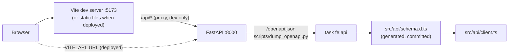

# Current State: Frontend

The web app lives in `frontend/` and is a **skeleton**: the tooling, the theme, the app shell and
the generated API client are in place, and the three areas of the navigation (Lineup, Roster,
Saved) are still "coming soon" pages. The screens arrive phase by phase (see [[Roadmap: Frontend]]
and `PLAN.md`). The backend it talks to is described in [[Current State: Backend]].

## How it is built

| Concern | Choice | Why |
|---|---|---|
| Language and UI | React 19 + TypeScript, built by Vite | Mainstream, fast dev server, one static bundle to host |
| Styling | Tailwind CSS v4 with the **Polaris** theme (`frontend/DESIGN.md`) as CSS variables in `src/index.css`, light and dark | Components use semantic tokens (`bg-primary`) and never raw colors, so the theme can change in one file |
| Components | shadcn-style, copied into `src/components/ui/` (Button, Card, Skeleton) on Radix primitives | We own the code and can keep Polaris's square corners |
| Routing | React Router (`src/app.tsx`) | Client-side navigation; `/`, `/roster`, `/saved` |
| Server data | TanStack Query with a shared retry policy, plus a backend-status check that runs on load (see *Cold starts* below) | The hosted API scales to zero, so the first request after idle is slow and loading and retrying are designed in from the start |
| API client | `openapi-fetch` over types generated by `openapi-typescript` from the backend's OpenAPI spec | A changed endpoint turns into a compile error instead of a runtime surprise |
| Tests | Vitest + Testing Library (jsdom) | Same runner as Vite, no browser needed for unit tests |
| Tooling | pnpm (pinned by `packageManager`), ESLint, Prettier, TypeScript pinned to 6.0 (typescript-eslint doesn't support 7 yet) | `task fe:*` wraps all of it |

### The app shell

`src/components/app-shell.tsx` is the frame every page sits in: a **sidebar on desktop** and a
**top bar plus bottom navigation on phones** (the switch is Tailwind's `md` breakpoint). It is
plain static markup, so it renders immediately even when the API is asleep. Both navigations come
from one list (`src/components/nav-items.ts`). The dark theme is a `dark` class on `<html>`, set
before first paint by `public/theme-init.js` (a separate file instead of an inline script, so a
strict Content-Security-Policy stays possible) and remembered in localStorage.

### The generated API client

`task fe:api` dumps the OpenAPI spec straight from the FastAPI app (no server needed) into
`src/api/openapi.json` and generates `src/api/schema.d.ts` from it. Both are committed, so API
changes show up in review, and `task fe:api:check` (run by CI) fails when they are stale. In dev
the client calls the same-origin `/api`, which Vite proxies to the container on `:8000`, so no CORS
configuration is needed locally; a deployed build sets `VITE_API_URL`.

### Cold starts

The API runs on free hosting that stops the machine when idle, so the first request after a break
takes a few seconds (and the first PDF longer). The UI is built so that never looks like a bug:

- **Static first.** The shell, navigation and headings are plain markup and render immediately.
  Every list or panel that needs data is its own `QueryBoundary` (`src/components/query-boundary.tsx`)
  with a `Skeleton` in the final shape of the content, so regions fill in independently. Buttons
  that start a request take `loading`, which shows a spinner and disables them so a slow save
  can't be submitted twice.
- **Wake-up check.** `BackendStatusProvider` (`src/backend-status/`) calls `GET /health` the moment
  the app loads, before any sign-in, which already starts a sleeping machine booting. It moves
  through `unknown -> waking -> ready`, or to `db-paused` / `down`:

  | State | Meaning | What the user sees |
  |---|---|---|
  | `unknown` | first check under ~1.5 s old | nothing |
  | `waking` | no answer after 1.5 s | amber banner "The server is starting up ..." with elapsed seconds (behind `VITE_COLD_START_NOTICE`, on unless set to `false`) |
  | `ready` | `/health` answered 200 | nothing |
  | `db-paused` | `/health` answered but `/health?db=true` returned 503 | banner: the database is paused (free tier) and someone must resume it |
  | `down` | no answer after ~60 s, or a non-retryable answer (e.g. 404 from a wrong API URL) | red banner with a "Try again" button |

  Liveness is polled with growing pauses (1 s, 2 s, 3 s, then 5 s) and only network errors and
  502/503/504 are retried. The readiness (`?db=true`) check runs once, after the API answered, and
  never blocks the UI.
- **Retries for data.** `createQueryClient()` (`src/api/query-client.ts`) retries queries only for
  transient failures (`isTransient`: no response, or 502/503/504) with 1 s, 2 s, 4 s, then 8 s
  backoff, about 47 s in total. A 4xx is never retried, and neither are mutations: repeating a
  save or a PDF render the user did not ask for twice is worse than an error message.
- **Timeouts.** Every call gets a 60 s timeout (`DEFAULT_TIMEOUT_MS`) so a hung connection ends;
  PDF generation uses 130 s (`PDF_TIMEOUT_MS`), above the backend's 120 s LibreOffice limit.
- **Errors in plain words.** `ApiError` carries the status; `describeError()` turns it into a short
  generic sentence. Server error text is never shown or logged, since it can contain hostnames or
  personal data.

### Privacy by construction

The font (Google Sans Flex) is self-hosted through Fontsource and nothing is loaded from a third
party, so a visitor's IP address never goes to Google Fonts. Everything in `frontend/.env*` that
starts with `VITE_` is public, so only public values belong there. The remaining browser-side
baseline (CSP and security headers, no trackers, clearing data on sign-out) is tracked in #97.

## CI and dependencies

A `Frontend` job in `ci.yml` runs lint + format check, type check, unit tests, the build and the
API-client freshness check on every PR; Dependabot watches `frontend/package.json` (`npm`
ecosystem). Details are in [[Current State: Everything Else]].

## Not built yet

Sign-in, the lineup form (next), the PDF-wait message, roster screens, saved-lineup previews, Cloudflare Pages deployment and
browser (Playwright) tests. See [[Roadmap: Frontend]].
