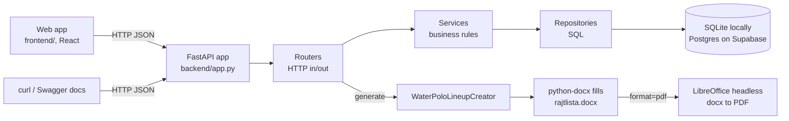
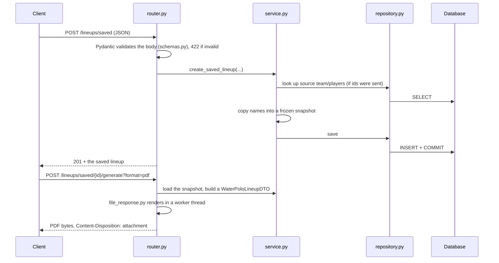

# Newcomer Guide

Written for someone who can program but has never seen this repo, and may not know every tool
in it. It explains **what** each piece is, **why** it's here and **where** it lives, and walks
one request through the code. Read it top to bottom once; afterwards the other pages make sense
as reference: [[Current State: Backend]] (architecture, data model, diagrams),
[[Current State: Everything Else]] (workflow, CI, container), [[Roadmap: Everything Else]]
(what's planned) and [[References]] (official docs for everything mentioned here).

## 1. What the project does

Before every water polo match the officials need a filled-in lineup sheet (the "rajtlista").
Lineup takes the match details and the players and fills a Word template
(`backend/resources/rajtlista.docx`), then returns it as a PDF (or the raw DOCX).

That is a small job, so the interesting part is everything around it, which is what you'll
spend your time on:

- a **web API** others can call (so a future web app and phone UI can use it),
- a **database** that stores teams, players and saved lineups so nobody retypes rosters,
- a **container** that bundles LibreOffice, because that is the only way we get a faithful PDF,
- **automation** (tests, CI, docs sync) that keeps all of it trustworthy.

## 2. The big picture



The web app in `frontend/` is just another HTTP client: it never touches the database or the
template itself. Its API types are generated from the backend's OpenAPI spec, so when an endpoint
changes the frontend build tells you.

Three things in this picture surprise newcomers:

1. **Document generation and the database are separate.** `POST /lineups` needs no database at
   all; it just fills the template. Saved lineups use the database to *gather* the data, then
   hand the same generation code a ready-made object.
2. **The frontend is a separate program with its own toolchain.** It is written in TypeScript, built
   with Node and pnpm, and never imports Python code; the only contract between the two sides is the
   HTTP API and its OpenAPI description.
3. **PDF needs the container.** LibreOffice is only installed inside the Docker image, so
   `task serve` (plain local server) can only produce DOCX. For PDFs you run `task build` then
   `task up`.

## 3. The tools, and why we use them

| Tool | What it is | Why it's here | Where to look |
|---|---|---|---|
| **Python 3.13** | The language | The whole backend | `backend/` |
| **FastAPI** | A web framework: you write functions, it turns them into HTTP endpoints and generates interactive docs at `/docs` | Type hints become validation and docs for free; async-friendly | `backend/app.py`, `*/router.py` |
| **Pydantic** | Describes the shape of data with classes and rejects anything that doesn't fit (HTTP 422) | Keeps bad input out of the business code | `*/schemas.py`, `lineup/api/models.py` |
| **SQLAlchemy (async)** | An ORM: Python classes map to database tables | One codebase runs on SQLite and Postgres | `lineup/db/models.py` |
| **Alembic** | Versioned database migrations ("change the schema the same way everywhere") | The hosted database can't be recreated on every start | `backend/alembic/` |
| **SQLite / Postgres (Supabase)** | A single-file database for local use / a hosted database | Zero setup locally, real database online | `DATABASE_URL` in `backend/.env.example` |
| **python-docx** | Reads and edits `.docx` files from Python | Fills the template | `lineup/document/document_manager.py` |
| **LibreOffice (headless)** | An office suite run without a window | Converts DOCX to PDF with a layout that matches the original | `lineup/document/pdf_converter.py` |
| **Docker + Compose** | Packages the app and LibreOffice (and the right fonts) into one image | Same PDF output on every machine | `backend/Dockerfile`, `compose.yml` |
| **uv** | Fast Python package manager (`uv.lock` pins exact versions) | Reproducible installs | `backend/pyproject.toml` |
| **React + TypeScript + Vite** | A UI library, typed JavaScript, and the dev server/bundler that serves and builds them | The web app, in `frontend/`, that works on phone and desktop | `frontend/src/` |
| **Tailwind + shadcn-style components** | Utility CSS classes and a set of copy-in UI components, themed with the Polaris design tokens | Consistent look (square corners, teal/amber, light and dark) without hand-written CSS | `frontend/src/index.css`, `frontend/DESIGN.md` |
| **React Hook Form + Zod** | Form state, and a schema that describes valid input | The lineup form checks the API's rules in the browser first, and maps the API's 422 errors onto the right inputs | `frontend/src/features/lineup/` |
| **TanStack Query** | A library that fetches, caches and retries server data in React | Handles loading states and the slow first request after the hosted API has been idle; `frontend/src/backend-status/` shows a "server is waking up" banner | `frontend/src/api/query-client.ts` |
| **openapi-typescript / openapi-fetch** | Generate TypeScript types from the API's OpenAPI description and a fetch client that uses them | A renamed field or changed endpoint becomes a compile error, not a runtime surprise | `frontend/src/api/` |
| **pnpm, ESLint, Prettier, Vitest** | Package manager (`pnpm-lock.yaml` pins versions), linter, formatter and test runner for the frontend | The frontend's counterparts of uv, Ruff and pytest | `task fe:*` |
| **Task** | A command runner; `Taskfile.yml` lists every command | One way to run things (`task test`), no copy-pasted shell | `Taskfile.yml` |
| **Ruff** | Linter and formatter, including security rules and a check that public code has a docstring | Catches bugs, style issues and undocumented code before review | `task lint`, `task format` |
| **pytest** | Test runner; coverage must stay at 100% | Safety net for refactoring | `backend/tests/` |
| **GitHub Actions** | Runs lint, tests, the container test and a docs check on every PR | Nothing broken reaches `develop` | `.github/workflows/` |
| **Claude Code + skills** | An AI assistant with project rules and recipes | Repetitive workflows (PRs, issues, audits) are written down once | `CLAUDE.md`, `.claude/skills/` |

## 4. Glossary

- **SPA** (single-page app): a web app that loads once and then switches screens in the browser,
  fetching only data from the API. That is what `frontend/` is.
- **Generated client**: code produced by a tool from a description. `frontend/src/api/schema.d.ts`
  is generated from the backend's OpenAPI spec (`task fe:api`); you commit it but never edit it.
- **Endpoint / route**: a URL plus HTTP method the API answers, e.g. `POST /lineups`.
- **DTO** (data transfer object): a plain object that carries data between layers. Here,
  `WaterPoloLineupDTO` is what the document code receives.
- **Service / repository**: a *service* holds the rules ("you can't delete a team that still has
  players"); a *repository* only talks to the database. Keeping them apart makes each easy to test.
- **Migration**: a script that changes the database schema one step; Alembic applies them in order.
- **Snapshot**: a saved lineup copies names as text instead of pointing at live rows, so later edits
  or deletions never change history.
- **Soft reference**: a nullable id that *remembers* where a snapshot came from but isn't required
  (`source_team_id`). The database sets it to `NULL` if the source is deleted.
- **Pooler**: a proxy in front of Postgres (Supabase's) that shares connections; it needs special
  client settings (see [[Current State: Backend]]).
- **RLS** (row-level security): Postgres rules that decide which rows a database role may see.
- **JWT**: a signed token proving who a user is; planned for sign-in (see [[Roadmap: Backend]]).
- **Coverage**: the percentage of code lines the tests execute; this repo requires 100%.
- **e2e test**: a test that drives the real running container instead of mocks.
- **Dev / prod**: our only two environments. Long-lived branches: `develop` (dev) and `main` (prod).

## 5. One request, start to finish

Take `POST /lineups/saved` followed by `POST /lineups/saved/{id}/generate`. Paths are relative to
`backend/`.



What each layer may and may not do:

- **`router.py`**: translate HTTP to Python and back. No business rules, no SQL.
- **`schemas.py`**: shape and limits of input and output (lengths, allowed values).
- **`service.py`**: business rules and errors (404 not found, 409 conflict). It raises
  `HTTPException`; there are no custom exception classes.
- **`repository.py`**: the only place that writes queries. The service never sees SQL.

The three persistence modules (`lineup/teams/`, `lineup/players/`, `lineup/saved_lineups/`) all
follow this four-file pattern, so once you've read `teams/` you can read the others.

Document generation (`lineup/water_polo/` and `lineup/document/`): `WaterPoloLineupCreator` takes
the DTO, `DocumentManager` writes the values into the template, and for PDFs `PdfConverter` runs
LibreOffice in a private temporary profile with a 120 second timeout. Only a couple of conversions run
at once (each is a heavy process), so a request that has to wait too long gets a 503. Both generate
endpoints share `lineup/api/file_response.py`, which maps failures to HTTP codes (busy → 503,
timeout → 504, anything else → 500).

## 6. Why saved lineups are snapshots

A match sheet is a historical record. If a player is later renamed or removed, last month's
lineup must still show what was true then. So a `SavedLineup` stores team, opponent and player
names as plain text, plus optional "soft" ids pointing at where they came from. Deleting a player
is therefore always safe; deleting a team that still has roster players is refused (409) because
those players would be orphaned. The full ERD is in [[Current State: Backend]].

## 7. Run it

Prerequisites: Python 3.13+, `uv`, `task`, Docker with Compose (see the README for links).

```bash
task install        # create backend/.venv and install dependencies
task test           # run the tests (must report 100% coverage)
task lint           # ruff
task serve          # local API on :8000, DOCX only; tables are created automatically
task build && task up    # full API in a container, with PDF output
task test-e2e       # real-conversion tests against the container
```

Then open `http://localhost:8000/docs` for the interactive API docs.

To run the web app as well, install Node.js (current LTS) and pnpm, then:

```bash
task fe:install     # install the frontend dependencies (exact versions from the lockfile)
task up             # the API container on :8000 (the app's backend)
task fe:dev         # the web app on http://localhost:5173
task fe:check       # lint + tests + build + 'is the generated API client fresh?'
```

In dev the browser calls `/api/...` on the Vite server, which forwards to `:8000`, so no CORS
setup is needed. Frontend commands run with `frontend/` as the working directory; the `task fe:*`
commands take care of it. Every Python command has to
run with `backend/` as the working directory (paths such as `./lineup.db` and `resources/…` are
relative to it); the `task` commands take care of that, so run them from the repo root.

With no configuration everything uses a local SQLite file. To try the hosted Postgres instead,
copy `backend/.env.example` to `backend/.env`, fill it in and use `task db:postgres`.

## 8. Tests

- Files in `backend/tests/` mirror the modules (`test_teams.py` tests `lineup/teams/`).
- API tests use the `async_client` fixture: a fresh in-memory database per test, so tests never
  affect each other or your real data.
- LibreOffice isn't available outside the container, so unit tests **mock** `PdfConverter.convert`;
  only the e2e suite (`task test-e2e`) runs the real thing.
- Coverage is enforced at 100%. If `task test` fails on coverage, you added a branch without a test.
- Frontend tests (`task fe:test`) are Vitest files next to the code (`*.test.ts(x)`); they render
  components with Testing Library and mock `fetch`, so they need no running API.

## 9. Make your first change

1. **Find or create the issue** (every branch and commit carries its number, `#123`). Issues follow
   a Problem / Evidence / Proposal / Acceptance template.
2. **Branch from `develop`**: `feat/123-short-name`, `fix/…` or `chore/…`. `main` is production and
   only receives release merges.
3. **Write the code and its tests.** New module → new `tests/test_<module>.py`. Changed code →
   update the existing tests.
4. **Check locally**: `task lint && task test` (and `task test-e2e` if you touched the document or
   container code).
5. **Document the code and the docs in the same change**: give every new public module, class, function or
   method a docstring (what it is for and why, not a restatement of its name; `task lint` fails on a
   missing one), then update `README.md` (how to use it), the matching page under
   `documentation/` (how it works), and `CLAUDE.md` (conventions). If nothing needs documenting,
   say `No doc impact: <reason>` in the PR. CI's docs check enforces this.
6. **Open a PR into `develop`.** CI must be green. PRs are merged with a **merge commit** (never
   squash or rebase), so keep your branch history tidy with `git commit --amend` or `--fixup`.

Example: adding an optional field to players touches `lineup/db/models.py` (column), a new Alembic
migration (`task migrate-new -- -m "add x to players"`), `players/schemas.py` (input and output),
the service if a rule applies, tests for the new behaviour, and the docs.

## 10. Gotchas that have bitten people

- **Async SQLAlchemy can't lazy-load.** Relationships are declared `lazy="selectin"` so they load
  up front; otherwise you get `MissingGreenlet`.
- **SQLite ignores foreign-key rules by default.** `enable_sqlite_foreign_keys()` turns them on
  per connection; without it `ON DELETE SET NULL` silently does nothing.
- **Postgres behind Supabase's pooler** needs prepared statements turned off and `NullPool`; SQLite
  tests cannot catch this, so the `supabase-smoke` skill exists for after engine or model changes.
- **Coverage and greenlets:** `concurrency = ["greenlet", "thread"]` in `pyproject.toml` is needed or
  coverage under-reports lines after an `await session.commit()`.
- **FastAPI routers:** don't use `from __future__ import annotations` in router files (it breaks
  query-parameter detection) and declare query parameters with `Annotated[..., Query(...)]`.
- **A browser on another origin is blocked unless you allow it.** `task fe:dev` avoids this by
  proxying `/api` to the API, but a deployed frontend or a dev server pointed straight at `:8000`
  (`VITE_API_URL`) is a different origin, so set `CORS_ORIGINS` in `backend/.env`. With it unset the API sends no CORS headers (curl and the docs page still work).
- **Text fields use the shared types in `lineup/common/types.py`** (trimmed, length-capped, no control
  characters). Use them for any new text field, or a stray tab/NUL can produce a 500 when the document is
  generated.
- **Lists have no "give me everything" mode.** `limit` is 1-200; page with `offset`.
- **Changed an endpoint or schema? Regenerate the frontend client.** Run `task fe:api` and commit
  `frontend/src/api/`; CI's `Frontend` job fails with "stale" otherwise.
- **Download file names** go through `content_disposition()` because HTTP header values are
  latin-1 and names like `ő`/`ű` would crash a plain `filename=`.
- **Every data route needs a signed-in user.** `get_current_user_id()` checks the Supabase access
  token (`Authorization: Bearer <jwt>`) and returns the user's id; a repository function always
  takes that id as a *required* argument, so there is no code path that "forgets" to filter. In
  tests the dependency is overridden (`current_user` fixture), so you don't need a token. To run
  the API locally against real sign-in, set `SUPABASE_URL` (see [[Auth Setup]]); without it the
  protected routes answer `503` on purpose.

## 11. Where to go next

- The code tour: `backend/app.py` → `lineup/api/router.py` → `lineup/water_polo/` →
  `lineup/document/` → `lineup/db/` → `lineup/teams/`.
- [[Current State: Backend]] for the data model and database configuration, and
  [[Current State: Frontend]] for how the web app is built.
- [[Current State: Everything Else]] for CI, containers and conventions.
- [[Roadmap: Everything Else]], `PLAN.md` and the GitHub issues/board for what's coming.
- [[References]] for the official documentation of every tool above.
- `CLAUDE.md` if you work with Claude Code: it holds the conventions the assistant follows.
