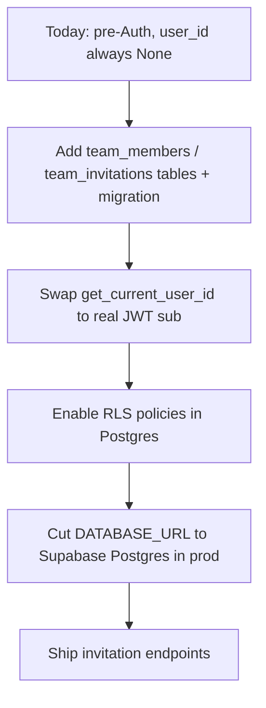

# Roadmap: Backend

Status (per `in-memory-db-plan.md`, the living design doc this page summarizes): core
persistence (Teams/Players/SavedLineups on the target snapshot schema) is **done**. Team
Collaboration and the Supabase/OAuth stage are **not started**.

## Planned data model additions

Two tables are designed in the ERD but not yet implemented: `TEAM_MEMBERS` and
`TEAM_INVITATIONS`.

```mermaid
erDiagram
    USERS ||--o{ TEAMS : "owns (owner_id)"
    USERS ||--o{ TEAM_MEMBERS : "belongs to"
    TEAMS ||--o{ TEAM_MEMBERS : "has members"
    TEAMS ||--o{ TEAM_INVITATIONS : "has pending invites"
    TEAMS ||--o{ PLAYERS : "has active roster"

    TEAM_MEMBERS {
        uuid team_id PK_FK
        uuid user_id PK
        string role "owner | admin | member"
        datetime joined_at
    }
    TEAM_INVITATIONS {
        uuid id PK
        uuid team_id FK
        uuid invited_by
        string invite_code
        string email "optional"
        string role
        string status "pending | accepted | revoked"
        datetime expires_at
    }
```

(`TEAMS`/`PLAYERS`/`SAVED_LINEUPS`/`LINEUP_PLAYER_SNAPSHOTS` already exist — see
[[Current State: Backend]] for that part of the ERD.)

## Supabase & OAuth integration

1. **Authentication**
   - Enable the Google OAuth provider in the Supabase dashboard.
   - Incoming requests send a Bearer JWT; FastAPI validates it and
     `get_current_user_id()` (`lineup/auth/dependencies.py`) returns `payload["sub"]`
     instead of `None` — **zero router or service changes needed**, since every repository
     already accepts and conditionally filters on `user_id`.
2. **Database driver cutover**
   - Add `asyncpg>=0.30` to production dependencies.
   - Set `DATABASE_URL=postgresql+asyncpg://...` in the production environment.
   - Run `alembic upgrade head` against Postgres.
3. **Row Level Security (RLS) in PostgreSQL**
   - `teams`: public read for `is_public = true` (powers the opponent pool); read/write
     restricted to `owner_id = auth.uid()` or team members.
   - `players` & `saved_lineups`: restricted to team members / creator
     (`auth.uid() = user_id`).
4. **Onboarding hook**
   - On first login, check if the user has an existing team or pending invitation.
   - If not, prompt for a team name → `POST /teams` → `owner_id = user_id`. This becomes
     the user's default team. (UI side of this is [[Roadmap: Frontend]].)
5. **Team invitations**
   - `POST /teams/{id}/invitations` — generate an invite code/link.
   - `POST /teams/join?invite_code=...` — adds the accepting user to `team_members`.

## Rollout sequencing



The order matters: the auth-readiness work (`user_id` columns, conditional `WHERE` filters)
is already in place, so swapping the dependency (step C) is low-risk and reversible — it's
deliberately sequenced before the Postgres/RLS cutover (steps D–E) so auth can be validated
against SQLite first.
