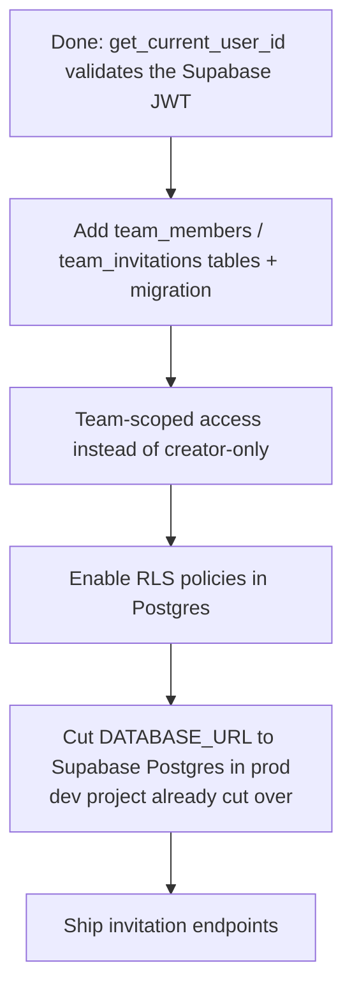

# Roadmap: Backend

Status: core persistence (Teams/Players/SavedLineups on the target snapshot schema) is
**done**, and the app can already run against a **dev** Supabase Postgres project (DB cutover
only — see [[Current State: Backend]]). Team Collaboration, real authentication, RLS and the
production Supabase project are **not started**. (The current-state design — ERD, snapshot
strategy — lives in [[Current State: Backend]]; this page only covers what is still ahead.)

## Planned data model additions

Two tables are designed in the ERD but not yet implemented: `TEAM_MEMBERS` and
`TEAM_INVITATIONS`.

```mermaid
erDiagram
    USERS ||--o{ TEAMS : "owns (owner_id)"
    USERS ||--o{ TEAM_MEMBERS : "belongs to"
    TEAMS ||--o{ TEAM_MEMBERS : "has members"
    TEAMS ||--o{ TEAM_INVITATIONS : "has pending invites"
    TEAMS ||--o{ PLAYERS : "has active roster"

    TEAM_MEMBERS {
        uuid team_id PK_FK
        uuid user_id PK
        string role "owner | admin | member"
        datetime joined_at
    }
    TEAM_INVITATIONS {
        uuid id PK
        uuid team_id FK
        uuid invited_by
        string invite_code
        string email "optional"
        string role
        string status "pending | accepted | revoked"
        datetime expires_at
    }
```

(`TEAMS`/`PLAYERS`/`SAVED_LINEUPS`/`LINEUP_PLAYER_SNAPSHOTS` already exist — see
[[Current State: Backend]] for that part of the ERD.)

## Supabase & OAuth integration

1. **Authentication**
   - *Code done:* `get_current_user_id()` (`backend/lineup/auth/dependencies.py`) validates the
     Bearer JWT against the project's JWKS and returns `sub`; every repository filters on the
     required user id (see [[Current State: Backend]]).
   - *Still manual (one-off, per project):* create the Google OAuth client and enable the Google
     provider in the Supabase dashboard — step by step in [[Auth Setup]].
2. **Production database cutover** *(remaining piece — the dev half is done)*
   - Done for dev: `asyncpg` is a dependency, the engine is dialect-aware, and the app runs
     against the `lineup-dev` Supabase project via `DATABASE_URL` (see
     [[Current State: Backend]]).
   - Still to do: create a separate `lineup-prod` Supabase project, run `alembic upgrade head`
     against it, and wire its `DATABASE_URL` + secrets into the deployment (paired with CD).

   This dev cutover is independent of the auth/RLS sequence below: the dev database can be
   used before any of steps 1, 3–5 exist.
3. **Row Level Security (RLS) in PostgreSQL**
   - *Done:* RLS is on for every table (deny by default), the `lineup_app` role exists and the
     API runs as it, with an interim allow-all policy (see [[Current State: Backend]]). The
     policies below replace that interim one.
   - `teams`: public read for `is_public = true` (powers the opponent pool); read/write
     restricted to `owner_id = auth.uid()` or team members.
   - `players` & `saved_lineups`: restricted to team members / creator
     (`auth.uid() = user_id`).
4. **Onboarding hook**
   - On first login, check if the user has an existing team or pending invitation.
   - If not, prompt for a team name → `POST /teams` → `owner_id = user_id`. This becomes
     the user's default team. (UI side of this is [[Roadmap: Frontend]].)
5. **Team invitations**
   - `POST /teams/{id}/invitations` — generate an invite code/link.
   - `POST /teams/join?invite_code=...` — adds the accepting user to `team_members`.

## Rollout sequencing

```mermaid
flowchart TD
    A[Done: get_current_user_id validates the Supabase JWT] --> B[Add team_members / team_invitations tables + migration]
    B --> C[Team-scoped access instead of creator-only]
    C --> D[Enable RLS policies in Postgres]
    D --> E[Cut DATABASE_URL to Supabase Postgres in prod<br/>dev project already cut over]
    E --> F[Ship invitation endpoints]
```

The order matters: the JWT check landed first, on its own, because it is small and reversible,
and team membership builds on a real user id. It is deliberately sequenced before the
Postgres/RLS cutover (steps D–E) so auth can be validated against SQLite first.
