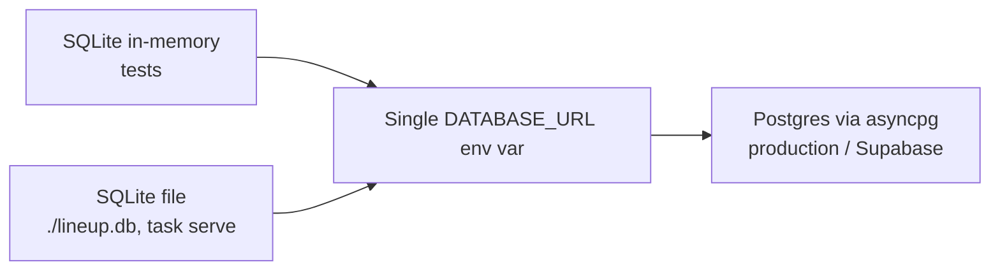

# Roadmap: Everything Else

Cross-cutting, forward-looking items that don't belong specifically to the backend or
frontend roadmap pages.

## Local dev → production database migration path

The repository abstraction (`schemas.py`/`repository.py`/`service.py`/`router.py` per
module) was deliberately built so this is a **single environment-variable change** plus
`alembic upgrade head` — no repository or service code needs to change when moving from
SQLite to Postgres. See [[Roadmap: Backend]] for the Supabase-specific steps (RLS, asyncpg
driver, auth cutover) and [[Current State: Backend]] for how the DB layer works today.

## Multi-tenancy rollout

`user_id`/`owner_id` columns already exist on every table and every repository already
applies conditional `WHERE user_id = :user_id` filtering — this was built in from day one
specifically so that turning on real multi-tenancy later is a dependency swap
(`get_current_user_id()`), not a schema or query rewrite. The remaining rollout risk is
almost entirely on the auth/Supabase side (see [[Roadmap: Backend]]) and the onboarding UI
(see [[Roadmap: Frontend]]), not on the persistence layer itself.

## Team collaboration

Sits at the intersection of backend (`team_members`/`team_invitations` schema + endpoints)
and frontend (accept/generate-invite UI) — tracked in detail on both of those pages. No
independent cross-cutting work identified beyond what's already listed there.
