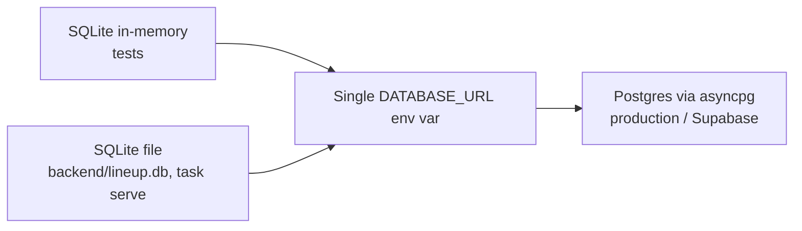
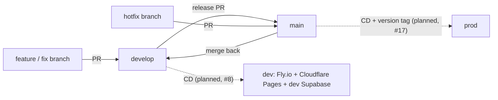

# Roadmap: Everything Else

Cross-cutting, forward-looking items that don't belong specifically to the backend or
frontend roadmap pages.

## Local dev → production database migration path

```mermaid
flowchart LR
    A[SQLite in-memory<br/>tests] --> C[Single DATABASE_URL env var]
    B[SQLite file<br/>backend/lineup.db, task serve] --> C
    C --> D[Postgres via asyncpg<br/>production / Supabase]
```

The repository abstraction (`schemas.py`/`repository.py`/`service.py`/`router.py` per
module) was deliberately built so this is a **single environment-variable change** plus
`alembic upgrade head` — no repository or service code needs to change when moving from
SQLite to Postgres. This already works for a **dev** Supabase project (the `asyncpg` driver and
dialect-aware engine are in place); the production project is still ahead. See
[[Roadmap: Backend]] for the remaining Supabase steps (prod project, auth, RLS) and
[[Current State: Backend]] for how the DB layer works today — including how to switch between
SQLite and Supabase, recover lost credentials, and migrate to a different stack later.

## Branching model and environments

The project is small (a handful of users), so it runs exactly **two environments — dev and
prod** — and one long-lived branch for each:

```mermaid
flowchart LR
    F[feature / fix branch] -->|PR| D[develop]
    D -->|"release PR"| M[main]
    H[hotfix branch] -->|PR| M
    M -->|merge back| D
    D -.->|"CD (planned, #8)"| DEV[dev: Fly.io + Cloudflare Pages + dev Supabase]
    M -.->|"CD + version tag (planned, #17)"| PROD[prod]
```

- `develop` is the default branch: every PR targets it, Dependabot targets it, and the wiki is
  published from it. Once CD exists, each merge deploys to dev.
- `main` only moves on a release (a `develop` → `main` PR) or a hotfix. Releases will later
  create the `vX.Y.Z` tag and deploy to prod.
- A separate test/staging environment was considered and dropped: with a handful of users,
  dev already is the place to try things before prod.

The work to get the dev environment running end-to-end (frontend, auth, invitations, CD) is
planned in `PLAN.md` at the repo root.

## Multi-tenancy rollout

`user_id`/`owner_id` columns already exist on every table and every repository already
applies conditional `WHERE user_id = :user_id` filtering — this was built in from day one
specifically so that turning on real multi-tenancy later is a dependency swap
(`get_current_user_id()`), not a schema or query rewrite. The remaining rollout risk is
almost entirely on the auth/Supabase side (see [[Roadmap: Backend]]) and the onboarding UI
(see [[Roadmap: Frontend]]), not on the persistence layer itself.

## Logging (future)

No live deployment exists yet, so there's nothing to point a log viewer at today. Once a
host is chosen (Fly.io, Supabase, or otherwise), start with that platform's built-in log
viewer — free, and sufficient at this traffic level. Only reach for a dedicated log
aggregator (Axiom, Better Stack, etc.) if/when volume or retention needs outgrow the
platform's built-in tooling.

## Team collaboration

Sits at the intersection of backend (`team_members`/`team_invitations` schema + endpoints)
and frontend (accept/generate-invite UI) — tracked in detail on both of those pages. No
independent cross-cutting work identified beyond what's already listed there.
