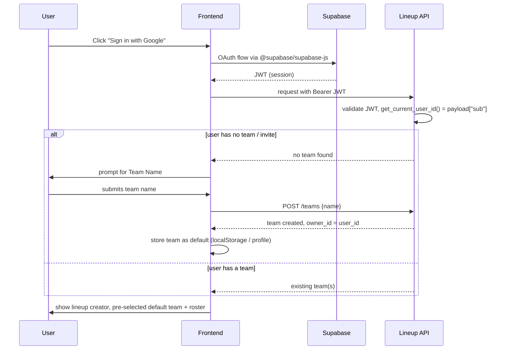

# Roadmap: Frontend

No frontend exists today (see [[Current State: Frontend]]). This page is the least-detailed
of the roadmap pages — the source design doc (`in-memory-db-plan.md`) only sketches the
frontend's role in passing, as a consumer of the backend's auth-readiness work. Treat this
as a starting sketch, not a spec.

## Planned OAuth / onboarding flow

## Anticipated UI surfaces

These map directly onto existing/planned backend endpoints (see [[Current State: Backend]]
and [[Roadmap: Backend]]) — no new backend work is implied beyond what's already scoped
there:

- **Lineup creator** — builds a `POST /lineups` (one-off) or `POST /lineups/saved` (from
  roster) request; opponent field offers both `GET /teams/pool` autocomplete and free text.
- **Roster management** — CRUD screens over `/teams`, `/players`.
- **Saved lineups list / "Clone to New Match"** — lists `/lineups/saved`, and on clone,
  matches each player's `source_player_id` against the current roster: still-present
  players get pre-selected, deleted ones fall back to the frozen snapshot name/NSSZ as free
  text with a "no longer on roster" hint.
- **Team invitations** — accept/generate invite links once `team_members`/
  `team_invitations` ship on the backend.

## Open questions (not yet decided)

- Framework/stack choice (React, Vue, Svelte, SSR vs. SPA) — nothing has been chosen.
- Where the frontend will be hosted/deployed relative to the API container.
- Whether it lives in this repo (e.g. a new `frontend/` directory) or a separate repo.
