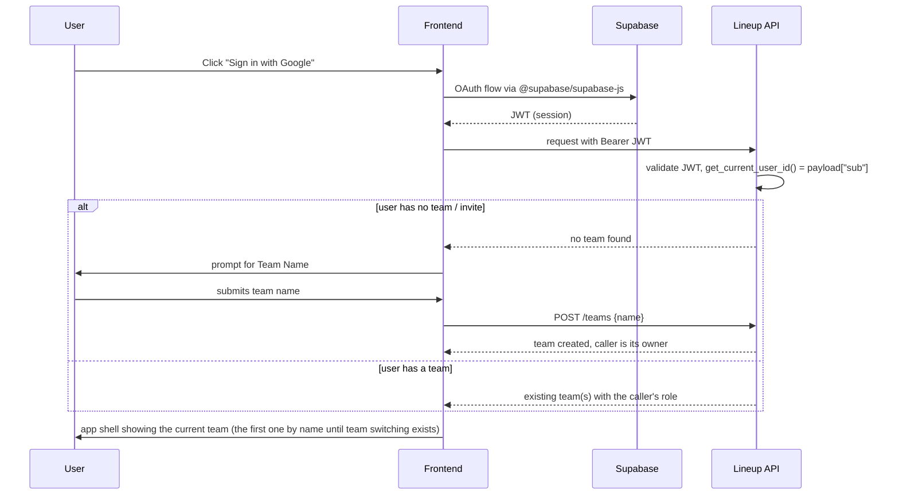

# Roadmap: Frontend

The frontend skeleton exists (see [[Current State: Frontend]]); this page records the decisions
behind it and what is still to come. The step-by-step plan, with issue numbers, is `PLAN.md`
(Phases 2-6); the backend side is in [[Roadmap: Backend]].

## Decisions

| Question | Decision | Why |
|---|---|---|
| Stack | React + TypeScript + Vite; Tailwind and shadcn-style components; TanStack Query; React Router; React Hook Form + Zod for forms; pdf.js for previews; Vitest + Playwright for tests | Mainstream choices with the most examples; nothing needs server-side rendering, so a static bundle is enough |
| API types | Generated from the backend's OpenAPI spec (openapi-typescript + openapi-fetch) | The two sides can't drift silently: CI fails when the generated client is stale |
| Hosting | Static files on Cloudflare Pages; the API on Fly.io (scale to zero) | Cheap, and a free tier is enough for a dev preview |
| Repository | Same repo, `frontend/` next to `backend/` | One PR can change an endpoint and its screen; CI treats each side separately |
| Auth | `@supabase/supabase-js` for Google sign-in only; all data goes through FastAPI, which validates the JWT | Supabase's Data API stays off, so there is one place for access rules |
| Theme | Polaris (deep teal, amber, square corners, light and dark) | Spec in `frontend/DESIGN.md` |
| Fonts | Self-hosted (Fontsource), no third-party requests | Google Fonts would send visitors' IPs to Google (GDPR, #97) |

## Where we are

Done: skeleton and tooling, the cold-start-aware data layer, the one-off lineup form that calls
`POST /lineups`, and sign-in with team onboarding (see [[Current State: Frontend]]); the real Google
sign-in still waits for the console setup in [[Auth Setup]]. Next (`PLAN.md`): deployment to
Cloudflare Pages (Phase 4), invitations (Phase 5), then roster, lineup creator with previews and
saved lineups (Phase 6).

## OAuth / onboarding flow (built)

```mermaid
sequenceDiagram
    participant User
    participant FE as Frontend
    participant Supabase
    participant API as Lineup API

    User->>FE: Click "Sign in with Google"
    FE->>Supabase: OAuth flow via @supabase/supabase-js
    Supabase-->>FE: JWT (session)
    FE->>API: request with Bearer JWT
    API->>API: validate JWT, get_current_user_id() = payload["sub"]
    alt user has no team / invite
        API-->>FE: no team found
        FE->>User: prompt for Team Name
        User->>FE: submits team name
        FE->>API: POST /teams {name}
        API-->>FE: team created, caller is its owner
    else user has a team
        API-->>FE: existing team(s) with the caller's role
    end
    FE->>User: app shell showing the current team (the first one by name until team switching exists)
```

## Anticipated UI surfaces

These map directly onto existing/planned backend endpoints (see [[Current State: Backend]]
and [[Roadmap: Backend]]) — no new backend work is implied beyond what's already scoped
there:

- **Lineup creator** — builds a `POST /lineups` (one-off) or `POST /lineups/saved` (from
  roster) request; opponent field offers both `GET /teams/pool` autocomplete and free text.
- **Roster management** — CRUD screens over `/teams`, `/players`.
- **Saved lineups list / "Clone to New Match"** — lists `/lineups/saved`, and on clone,
  matches each player's `source_player_id` against the current roster: still-present
  players get pre-selected, deleted ones fall back to the frozen snapshot name/NSSZ as free
  text with a "no longer on roster" hint.
- **Team invitations** — accept/generate invite links (Phase 5, #51). The onboarding screen
  already shows the "join with an invite link" field, disabled, and the `/join/:code` page has to
  survive the Google sign-in round trip (the sign-in page already forwards to a remembered path).

## Still open

- Exact Content-Security-Policy and security headers for Cloudflare Pages (#97).
- Whether the production API gets a custom domain (and so a same-site frontend) or stays on the
  provider's hostname.
